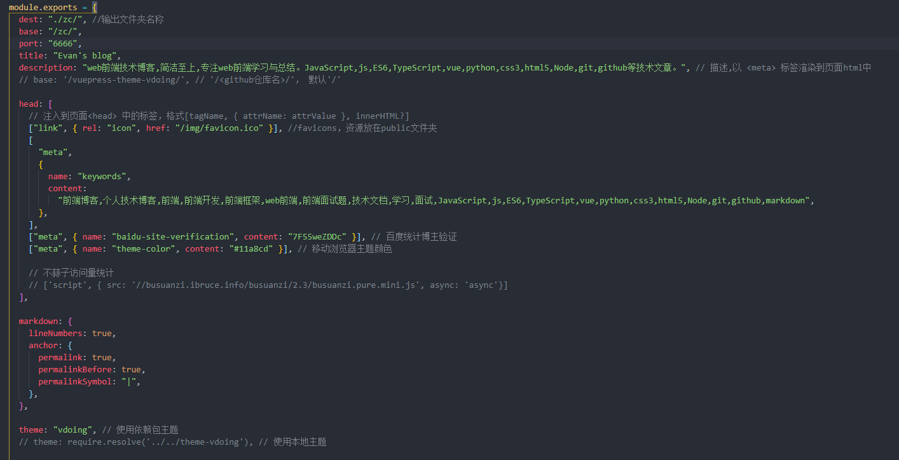

# vue 路由传参

vue 路由常用配置和参数的配置

<!-- more -->

## 第一种

```swift
       this.$router.push({
          path: `/describe/${id}`,
        })
```

路由配置:

```swift
{
  path: '/describe/:id',
  name: 'Describe',
  component: Describe
}
```

### 接收参数

```swift
this.$route.params.id
```

## 第二种

```swift
     this.$router.push({
          name: 'Describe',
          params: {
            id: id
          }
        })
```

路由配置

```swift
 {
     path: '/describe',
     name: 'Describe',
     component: Describe
   }
```

获取参数:

```swift
this.$route.params.id
```

## 第三种

> query 会在路由显示

```swift
      this.$router.push({
          path: '/describe',
          query: {
            id: id
          }
        })
```

路由配置:

```swift
{
     path: '/describe',
     name: 'Describe',
     component: Describe
   }
```

#### 参数获取:

```swift
this.$route.query.id


```

```js
this.$router.push({
  name: "5",
  query: {
    id: a.id,
  },
});

this.$router.push({
  name: "Catalog",
  query: {
    id: data.id,
  },
});

if (aa) {
  // 获取上方信息
  const { data: res } = await this.$http.get(` findcarbyid?id=${aa}`);
  // this.liList = res.data;
  console.log(res);

  if (res.status != 200) {
    return this.$message.error(res.message);
  }
  this.$message(res.message);
}
```



作者：菜鸟何时起飞
链接：https://www.jianshu.com/p/095e05d85516
来源：简书
著作权归作者所有。商业转载请联系作者获得授权，非商业转载请注明出处。
