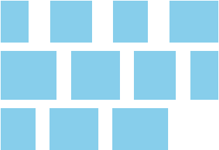
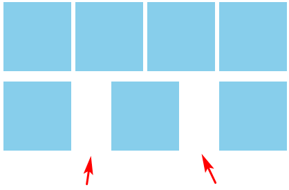
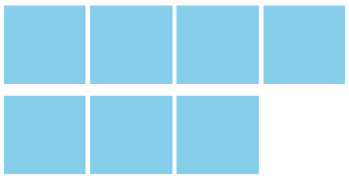
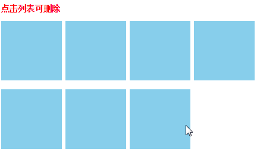
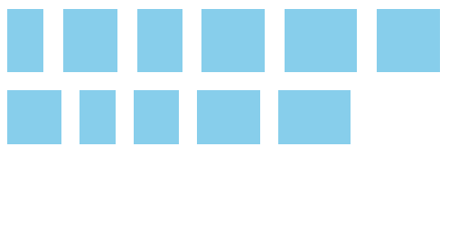
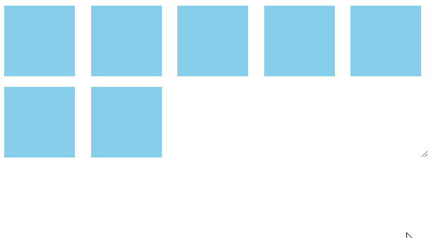

# 让 CSS flex 布局最后一行列表左对齐的 N 种方法



### 一、justify-content 对齐问题描述

在 CSS flex 布局中，`justify-content`属性可以控制列表的水平对齐方式，例如`space-between`值可以实现两端对齐。

但是，如果最后一行的列表的个数不满，则就会出现最后一行没有完全垂直对齐的问题。

如下代码：

```
.container {
    display: flex;
    justify-content: space-between;
    flex-wrap: wrap;
}
.list {
    width: 24%; height: 100px;
    background-color: skyblue;
    margin-top: 15px;
}
```

然后列表的个数不多不少正好 7 个：

```html
<div class="container">
  <div class="list"></div>
  <div class="list"></div>
  <div class="list"></div>
  <div class="list"></div>
  <div class="list"></div>
  <div class="list"></div>
  <div class="list"></div>
</div>
```

此时最后一行的小方块的排列就显得很尴尬了：



您可以狠狠地点击这里：[最后一行 flex 列表没有对齐 demo](https://www.zhangxinxu.com/study/201908/flex-last-align-demo.php)

此时，最后一行应该左对齐排列才是我们想要的效果，如何实现呢？

其实实现的思路和 [display:inline-block 的两端对齐](https://www.zhangxinxu.com/wordpress/?p=1514)是一样的。

### 二、如果每一行列数是固定的

如果每一行列数是固定的，则下面两种方法可以实现最后一行左对齐。

#### 方法一：模拟 space-between 和间隙

也就是我们不使用`justify-content:space-between`声明在模拟两端对齐效果。中间的 gap 间隙我们使用 margin 进行控制。

例如：

```html
.container { display: flex; flex-wrap: wrap; } .list { width: 24%; height: 100px; background-color: skyblue; margin-top: 15px; }
.list:not(:nth-child(4n)) { margin-right: calc(4% / 3); }
```

此时，布局效果是这样的：



#### 方法二：根据个数最后一个元素动态 margin

由于每一列的数目都是固定的，因此，我们可以计算出不同个数列表应当多大的`margin`值才能保证完全左对齐。

例如，假设每行 4 个元素，结果最后一行只有 3 个元素，则最后一个元素的`margin-right`大小是 “列表宽度 + 间隙大小” 的话，那最后 3 个元素也是可以完美左对齐的。

然后，借助树结构伪类数量匹配技术（这篇文章 “[伪类匹配列表数目实现微信群头像 CSS 布局的技巧](https://www.zhangxinxu.com/wordpress/2019/03/nth-last-child-css-layout/)” 中的布局技巧就是借助这种技术实现），我们可以知道最后一行有几个元素。

例如：

- `.list:last-child:nth-child(4n - 1)`说明最后一行，要么 3 个元素，要么 7 个元素……
- `.list:last-child:nth-child(4n - 2)`说明最后一行，要么 2 个元素，要么 6 个元素……

在本例中，一行就 4 个元素，因此，我们可以有如下 CSS 设置：

```html
.container { display: flex; /* 两端对齐 */ justify-content: space-between; flex-wrap: wrap; } .list { width: 24%; height: 100px; background-color:
skyblue; margin-top: 15px; } /* 如果最后一行是3个元素 */ .list:last-child:nth-child(4n - 1) { margin-right: calc(24% + 4% / 3); } /*
如果最后一行是2个元素 */ .list:last-child:nth-child(4n - 2) { margin-right: calc(48% + 8% / 3); }
```

效果如下 GIF 示意，删除列表后，布局依然稳稳地左对齐。



眼见为实，您可以狠狠地点击这里：[动态匹配数量实现 flex 子项左对齐 demo](https://www.zhangxinxu.com/study/201908/flex-last-align-left-number-match-demo.php)

### 三、如果每一子项宽度不固定

有时候，每一个 flex 子项的宽度都是不固定的，这个时候希望最后一行左对齐该如何实现呢？

由于此时间隙的大小不固定，对齐不严格，因此，我们可以直接让最后一行左对齐即可。具体方法有两个：

#### 方法一：最后一项 margin-right:auto

CSS 代码如下：

```html
.container { display: flex; justify-content: space-between; flex-wrap: wrap; } .list { background-color: skyblue; margin: 10px; } /*
最后一项margin-right:auto */ .list:last-child { margin-right: auto; }
```

最终效果如下 GIF：



#### 方法二：创建伪元素并设置 flex:auto 或 flex:1

CSS 代码如下：

```html
.container { display: flex; justify-content: space-between; flex-wrap: wrap; } .list { background-color: skyblue; margin: 10px; } /*
使用伪元素辅助左对齐 */ .container::after { content: ''; flex: auto; /* 或者flex: 1 */ }
```

最终效果如下 GIF：


这两个方法我合在一个 demo 页面了，您可以狠狠的点击这里：[flex 子元素宽度不固定最后一行左对齐 demo](https://www.zhangxinxu.com/study/201908/flex-width-auto-last-align-demo.php)

### 四、如果每一行列数不固定

如果每一行的列数不固定，则上面的这些方法均不适用，需要使用其他技巧来实现最后一行左对齐。

这个方法其实很简单，也很好理解，就是使用足够的空白标签进行填充占位，具体的占位数量是由最多列数的个数决定的，例如这个布局最多 7 列，那我们可以使用 7 个空白标签进行填充占位，最多 10 列，那我们需要使用 10 个空白标签。

如下 HTML 示意：

```
<div class="container">
    <div class="list"></div>
    <div class="list"></div>
    <div class="list"></div>
    <div class="list"></div>
    <div class="list"></div>
    <div class="list"></div>
    <div class="list"></div>
    <i></i><i></i><i></i><i></i><i></i>
</div>
```

相关 CSS 如下，实现的关键就是占位的`<i>`元素宽度和`margin`大小设置得和`.list`列表元素一样即可，其他样式都不需要写。

```
.container {
    display: flex;
    justify-content: space-between;
    flex-wrap: wrap;
    margin-right: -10px;
}
.list {
    width: 100px; height:100px;
    background-color: skyblue;
    margin: 15px 10px 0 0;
}
/* 和列表一样的宽度和margin值 */
.container > i {
    width: 100px;
    margin-right: 10px;
}
```

由于`<i>`元素高度为 0，因此，并不会影响垂直方向上的布局呈现。

最后的效果如下 GIF 图示：



您可以狠狠地点击这里：[使用空白元素占位让 flex 布局最后一行左对齐 demo](https://www.zhangxinxu.com/study/201908/flex-last-align-empty-element-replace-demo.php)

### 五、如果列数不固定 HTML 又不能调整

然而有时候，由于客观原因，前端重构人员没有办法去调整 html 结构，同时布局的列表个数又不固定，这个时候该如何实现我们最后一行左对齐效果呢？

我们不妨可以试试使用 Grid 布局。

Grid 布局天然有 gap 间隙，且天然格子对齐排布，因此，实现最后一行左对齐可以认为是天生的效果。

CSS 代码如下：

```
.container {
    display: grid;
    justify-content: space-between;
    grid-template-columns: repeat(auto-fill, 100px);
    grid-gap: 10px;
}
.list {
    width: 100px; height:100px;
    background-color: skyblue;
    margin-top: 5px;
}
```

可以看到 CSS 代码非常简洁。

HTML 代码就是非常规整非常普通的代码片段：

```
<div class="container">
    <div class="list"></div>
    <div class="list"></div>
    <div class="list"></div>
    <div class="list"></div>
    <div class="list"></div>
    <div class="list"></div>
    <div class="list"></div>
</div>
```

最后的效果如下 GIF：


您可以狠狠地点击这里：[CSS grid 布局让最后一行左对齐 demo](https://www.zhangxinxu.com/study/201908/last-align-left-by-css-grid-demo.php)

### 六、这几种实现方法点评

首先最后一行需要左对齐的布局更适合使用 CSS grid 布局实现，但是，`repeat()`函数兼容性有些要求，IE 浏览器并不支持。如果项目需要兼容 IE，则此方法需要斟酌。

然后，适用范围最广的方法是使用空的元素进行占位，此方法不仅适用于列表个数不固定的场景，对于列表个数固定的场景也可以使用这个方法。但是有些人代码洁癖，看不惯这种空的占位的 html 标签，则可以试试一开始的两个方法，一是动态计算 margin，模拟两端对齐，另外一个是根据列表的个数，动态控制最后一个列表元素的 margin 值实现左对齐。

累计 6 种方法，各有各的优缺点，大家根据自己项目的实际场景，选择合适的方法。

如果你有其他更好的实现，也欢迎反馈与交流，我会及时在文中更新。

感谢您的阅读，如果您觉得本文内容还不错，欢迎分享给你的小伙伴们！


本文为原创文章，欢迎分享，勿全文转载，如果内容你实在喜欢，可以加入收藏夹，永不过期，而且还会及时更新知识点以及修正错误，阅读体验也更好。  
本文地址：[https://www.zhangxinxu.com/wordpress/?p=8855](https://www.zhangxinxu.com/wordpress/?p=8855)
