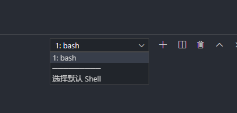

# shell 命令的使用

## 简介

现在我们使用的操作系统（Windows、Mac OS、Android、iOS 等）都是带图形界面的，简单直观，容易上手，对专业用户（程序员、网管等）和普通用户（家庭主妇、老年人等）都非常适用；计算机的普及离不开图形界面。

然而在计算机的早期并没有图形界面，我们只能通过一个一个地命令来控制计算机，这些命令有成百上千之多，且不说记住这些命令非常困难，每天面对没有任何色彩的“黑屏”本身就是一件枯燥的事情；这个时候的计算机还远远谈不上炫酷和普及，只有专业人员才能使用。


::: tip

注意:windows 下需要使用 git 才能执行这个命令,在 vscode 中需要将 bash 配置为默认才可继续使用.

:::

<!-- more -->




```shell
set -e
 echo "你好"

time3=$(date "+%Y-%m-%d %H:%M:%S")
ooz="来自github action的自动部署,时间:"$time3",张大明"

 msg='来自github actions的自动部署 20200602'$(date "+%Y-%m-%d %H:%M:%S")
 echo '正在自动部署'$(date "+%Y-%m-%d %H:%M:%S")
 echo $msg
sleep 2s
echo $ooz
sleep 2s

echo "你好"
```

### 定时器

```javascript

sleep 1s

// 等待一秒


```

### 变量拼接和使用

```javascript

sleep 1s

// 等待一秒
ooz="来自github action的自动部署,时间:"$time3",张大明"
echo $ooz


```

## 参考

- [MDN](http://c.biancheng.net/view/706.html) shell 入门基础
