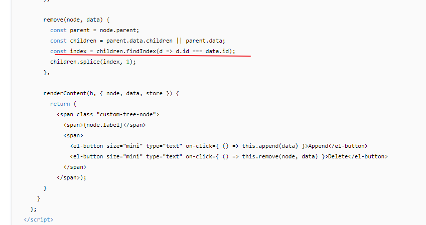

# es6数组方法find()、findIndex()与filter()的总结


## find()

该方法主要应用于查找第一个符合条件的数组元素。它的参数是一个回调函数。在回调函数中可以写你要查找元素的条件，当条件成立为true时，返回该元素。如果没有符合条件的元素，返回值为undefined。

以下代码在myArr数组中查找元素值大于4的元素，找到后立即返回。返回的结果为查找到的元素：


```jsx
const myArr=[1,2,3,4,5,6];
var v=myArr.find(value=>value>4);
console.log(v);// 5
```

没有符合元素，返回undefined:


```jsx
const myArr=[1,2,3,4,5,6];
var v=myArr.find(value=>value>40);
console.log(v);// undefined
```

回调函数有三个参数。value：当前的数组元素。index：当前索引值。arr：被查找的数组。

查找索引值为4的元素：


```jsx
const myArr=[1,2,3,4,5,6];
var v=myArr.find((value,index,arr)=>{
    return index==4
});
console.log(v);// 5
```

## findIndex()

findIndex()与find()的使用方法相同，只是当条件为true时findIndex()返回的是索引值，而find()返回的是元素。如果没有符合条件元素时findIndex()返回的是-1，而find()返回的是undefined。findIndex()当中的回调函数也是接收三个参数，与find()相同。


```jsx
const bookArr=[
    {
        id:1,
        bookName:"三国演义"
    },
    {
        id:2,
        bookName:"水浒传"
    },
    {
        id:3,
        bookName:"红楼梦"
    },
    {
        id:4,
        bookName:"西游记"
    }
];
var i=bookArr.findIndex((value)=>value.id==4);
console.log(i);// 3
var i2=bookArr.findIndex((value)=>value.id==100);
console.log(i2);// -1
```




## filter()

filter()与find()使用方法也相同。同样都接收三个参数。不同的地方在于返回值。filter()返回的是数组，数组内是所有满足条件的元素，而find()只返回第一个满足条件的元素。如果条件不满足，filter()返回的是一个空数组，而find()返回的是undefined


```jsx
var userArr = [
    { id:1,userName:"laozhang"},
    { id:2,userName:"laowang" },
    { id:3,userName:"laoliu" },
]
console.log(userArr.filter(item=>item.id>1));
//[ { id: 2, userName: 'laowang' },{ id: 3, userName: 'laoliu' } ]
```

数组去重：


```jsx
var myArr = [1,3,4,5,6,3,7,4];
console.log(myArr.filter((value,index,arr)=>arr.indexOf(value)===index));
//[ 1, 3, 4, 5, 6, 7 ]
```


