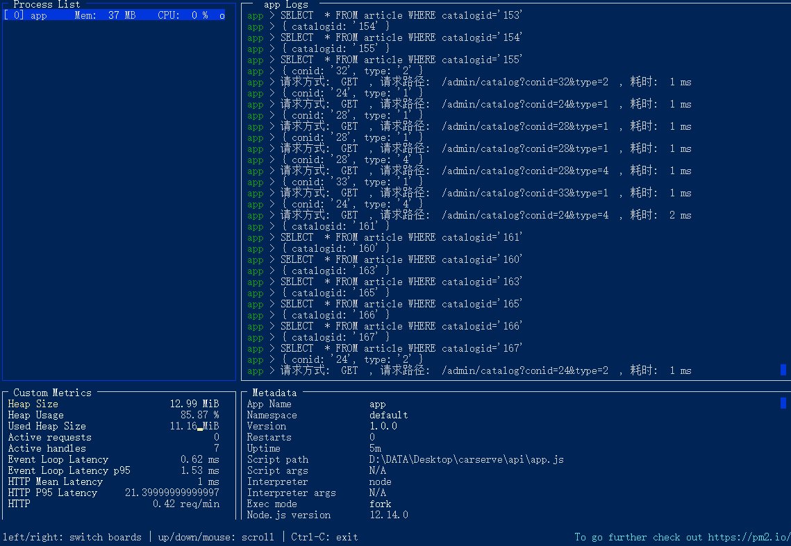

# pm2 使用说明

## 简介

PM2 是 node 进程管理工具，可以利用它来简化很多 node 应用管理的繁琐任务，如性能监控、自动重启、负载均衡等，而且使用非常简单。

下面就对 PM2 进行入门性的介绍，基本涵盖了 PM2 的常用的功能和配置

<!-- more -->



## 安装

全局安装，简直不能更简单。

```js
npm install -g pm2
```

## pm2 常用命令记录

\$ pm2 start app.js # 启动 app.js 应用程序

\$ pm2 stop all # 停止所有的应用程序

\$ pm2 start app.js --watch # 当文件变化时自动重启应用

\$ pm2 list # 列表 PM2 启动的所有的应用程序

\$ pm2 restart all # 重启所有应用

\$ pm2 restart app.js # 重启部分应用

\$ pm2 start app.js --name="api" # 启动应用程序并命名为 "api"

## PM2 设置开机自启动

- 运行 `pm2 startup`，即在`/etc/init.d/`目录下生成`pm2-root`的启动脚本，且自动将`pm2-root`设为服务。

* 运行 `pm2 save`，会将当前 pm2 所运行的应用保存在`/root/.pm2/dump.pm2`下，当开机重启时，运行`pm2-root`服务脚本，并且到`/root/.pm2/dump.pm2`下读取应用并启动。

## 其他命令

\$ pm2 show [app-name] # 显示应用程序的所有信息

\$ pm2 start app.js --name="api" # 启动应用程序并命名为 "api"

\$ pm2 start script.sh # 启动 bash 脚本

\$ pm2 monit # 显示每个应用程序的 CPU 和内存占用情况

\$ pm2 start app.js -i 4 # cluster mode 模式启动 4 个 app.js 的应用实例

\# 4 个应用程序会自动进行负载均衡

\$ pm2 logs # 显示所有应用程序的日志

\$ pm2 logs [app-name] # 显示指定应用程序的日志

\$ pm2 flush # 清空所有日志文件

\$ pm2 stop 0 # 停止 id 为 0 的指定应用程序

\$ pm2 reload all # 重启 cluster mode 下的所有应用

\$ pm2 gracefulReload all # Graceful reload all apps in cluster mode

\$ pm2 delete all # 关闭并删除所有应用

\$ pm2 delete 0 # 删除指定应用 id 0

\$ pm2 scale api 10 # 把名字叫 api 的应用扩展到 10 个实例

\$ pm2 reset [app-name] # 重置重启数量

\$ pm2 startup # 创建开机自启动命令

\$ pm2 save # 保存当前应用列表

\$ pm2 resurrect # 重新加载保存的应用列表

\$ pm2 update # Save processes, kill PM2 and restore processes

\$ pm2 generate # Generate a sample json configuration file

pm2 文档地址：http://pm2.keymetrics.io/docs/usage/quick-start/
