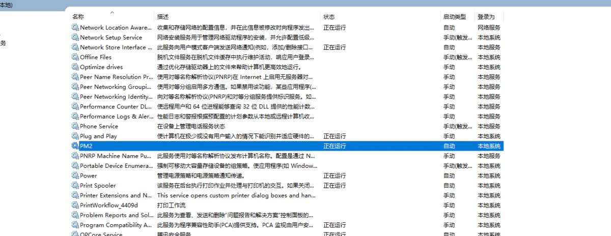
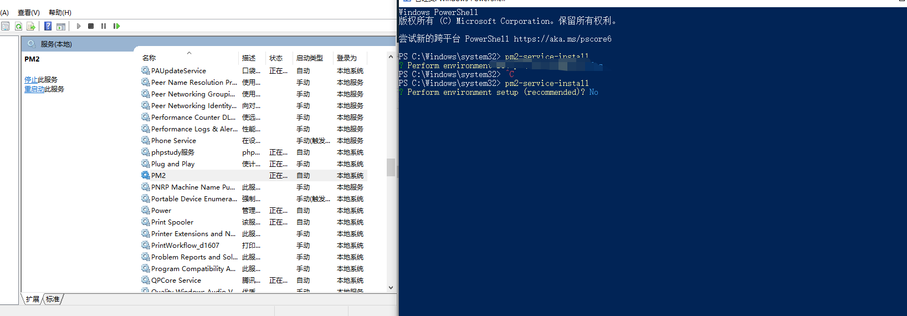

# pm2 设置自动启动服务（Windows 系统）

## 全局安装 pm2

```undefined
npm i pm2 -g
```

## 安装并配置 pm2-windows-service

## 好像测试了 win10 系统无法使用

```undefined
npm i -g pm2-windows-service
```

## 添加 pm2 环境变量

右键 [我的电脑] - [属性] - [高级系统设置] - [环境变量] - 新建 [系统变量]
名称`PM2_HOME`
路径`C:\Users\Admin\.pm2`

## 安装服务

```
以管理员权限打开新的命令行窗口,执行以下命令来安装服务
```

```undefined
pm2-service-install
```

`Perform environment setup ?` 选 `n`, 继续
此时, PM2 服务已安装成功并已启动, 可以通过 Win+R 来查看，输入 services.msc 即可看到服务



微信图片\_20190521101840.png

> ```
> 看到服务启动成功之后 先关闭这个服务 不要问为什么经验之谈
> ```

## 启动 node 程序

```undefined
pm2 start 你要启动的项目
```

## 添加要启动启动服务列表

```undefined
pm2 save
```

最后一步 把刚才设置自动启动的 pm2 服务打开 重启电脑就能看到成功了


