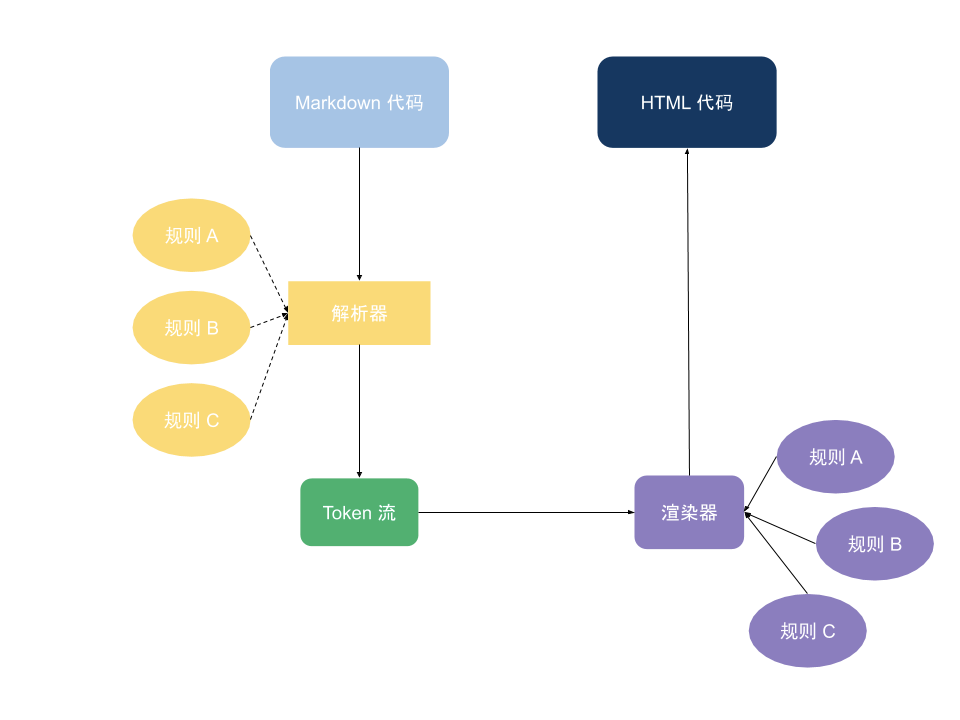
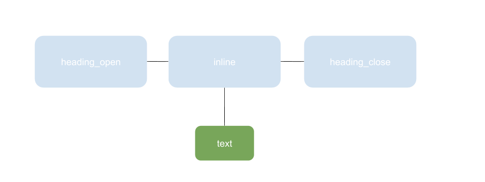
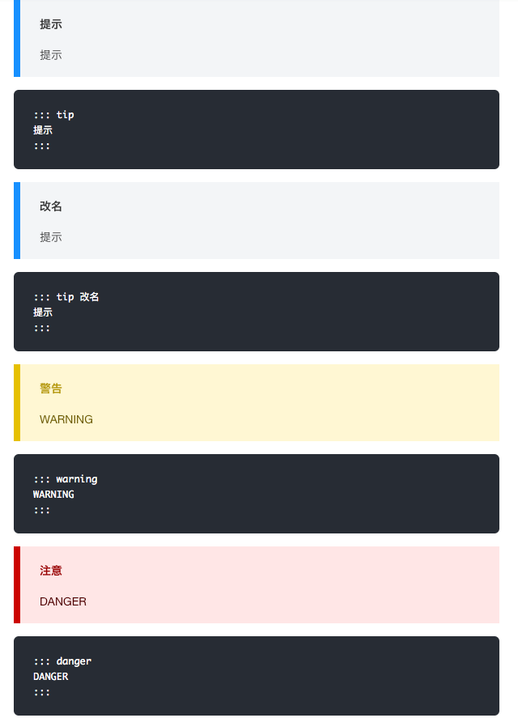
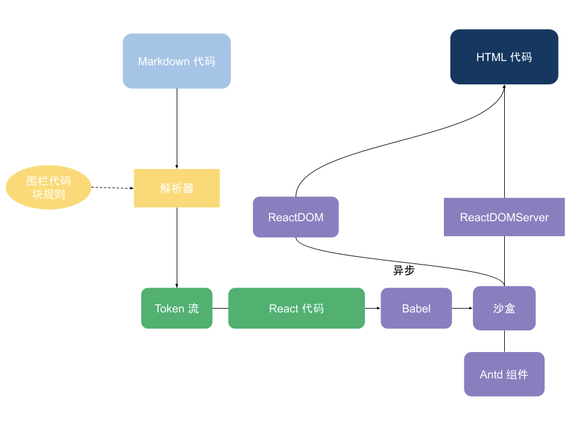

# markdown-it 原理浅析

前言

最近使用 markdown-it 比较多，也开发了一些插件，在这个过程中对源码进行了研读，最终写了这篇文章。需要了解细节的读者可以自行阅读[文档](https://links.jianshu.com/go?to=https%3A%2F%2Fmarkdown-it.docschina.org)。

此文分为两个部分：原理剖析和原理应用（编写插件）。

## markdown-it 原理

输入一串 markdown 代码，最后得到一串 html 代码，整体流程如下：

 1.png

我们以一个简单的例子来解释整个流程：`# 我是一个例子` -> `<h1>我是一个例子</h1>`

首先，它会被解析器拿到，经过各个解析规则处理后得到一个 token 流，接着这个 token 流被渲染器拿到，经过各个渲染规则处理后逐步拼接成一个 html 字符串。

<!-- more -->

### 解析器

markdown-it 内置了七个核心规则，在上图我对解析规则使用了虚线，因为它们是可以被启用 / 禁用的。我们这篇文章只来聊聊最核心的两个规则：block 和 inline。

规范指出：

> 我们可以将一篇 Markdown 文档视为一系列块，[块](https://links.jianshu.com/go?to=https%3A%2F%2Fgithub.github.com%2Fgfm%2F%23blocks)是一种结构化的元素，如段落，块引用，列表，标题，规则和代码块。一些块（如块引号和列表项）可以包含其他块; 其他（如标题和段落）包含[内联](https://links.jianshu.com/go?to=https%3A%2F%2Fgithub.github.com%2Fgfm%2F%23inline)内容，如文本，链接，强调文本，图像，行内代码等。

> 块结构的解析优先级始终高于内联结构。这意味着解析可以分两步进行：  
> 1\. 识别 markdown 文档的块结构;  
> 2\. 将段落，标题和其他块结构中的文本行，作为内联结构解析。

> 注意，第一步需要按顺序处理行，但第二步可以并行化，因为一个块元素的内联解析不会影响任何其他块的内联解析。

> 块分为两种类型：[容器块](https://links.jianshu.com/go?to=https%3A%2F%2Fgithub.github.com%2Fgfm%2F%23container-block)和[叶子块](https://links.jianshu.com/go?to=https%3A%2F%2Fgithub.github.com%2Fgfm%2F%23leaf-block)，容器块可以包含其他块，但叶子块不能包含其他块。

具体解析时，会围绕着 line 和 character 两个维度来解析。

对于每一行来说，解释的结果有以下三种：

1.  用来关闭一个或多个块结构。

2.  用来创建一个或多个新块结构，作为最后打开的块结构的子节点。

3.  可以将文本添加到树上剩余的最后（最深的）打开的块结构上。

对于我们这个例子，会先创建一个 heading 块，然后将文本内容添加到这个块上。下一行没有内容，于是块关闭。

字符包括非空白字符和空格 (U+0020)，制表符 (U+0009)，换行符 (U+000A)，行列表（U+000B），换页（U+000C）或回车（U+000D）这些空白字符。这里我们不做展开。

这期间会接触到的规则有 block、inline、heading、text。

1.  block 规则，会用来解析 `# 我是一个例子`

- 先进入 tokenize 函数，内含十一个 block 规则。

- heading 规则

- 得到 heading_open 、inline、 heading_close 三个 token

2.  inline 规则，会用来解析 `我是一个例子`

- 先进入 parse 函数，内含四个 inline 规则

- text 规则

- 得到 text 的 token

解析完毕，我们得到了 3 + 1 个 token：



### token 流

这里我们得到的结果不是一颗 AST 树，而是一个数组，markdown-it 称之为 token 流。为什么呢？

官方解释是：

- Tokens 是一个简单的数组。（AST 是一个对象）

- 打开的标签和关闭的标签可以隔离。

- 将 “内联容器(inline container)” 作为一种特殊的 block token 对象。它有嵌套的 tokens，如粗体，斜体，文本等等。

这样做有什么好处呢？这样就可以并行处理 block 和 inline 类型的 token 了。

生成 token 流后，它们就被会传递给 [renderer](https://links.jianshu.com/go?to=https%3A%2F%2Fgithub.com%2Fmarkdown-it%2Fmarkdown-it%2Fblob%2Fmaster%2Flib%2Frenderer.js)。

### 渲染器

它会遍历所有 token，将每个 token 传递给与 token 的 type 属性同名的规则。markdown-it 内置了九种规则：围栏、行内代码、代码块、html 块、行内 html、图片、硬换行、软换行、文本。

type 属性不在内置规则的 token 将会被被传入 [renderToken](https://links.jianshu.com/go?to=https%3A%2F%2Fgithub.com%2Fmarkdown-it%2Fmarkdown-it%2Fblob%2F1ad3aec2041cd2defa7e299543cc1e42184b680d%2Flib%2Frenderer.js%23L193) 中当一个普通 token 处理，这里不作展开。

回到我们的例子中来：

heading_open 会被渲染成 <h1>inline 中的 text 会被渲染成 我是一个例子 heading_close 会被渲染成 </h1>

markdown-it 插件

一些 markdown-it 插件就利用了上述的原理。

## markdown-it-container

这个插件可以让你支持内容块：比较常见的是提示、警告、危险。用于强调一块特定内容。

 3.png

这是如何实现的呢？我们可以根据之前的介绍推测一个内容块的 token 流：

第一行和第三行有 block 型的 token，一个代表 open，一个代表 close。第二行是 inline 型的 token，其中的内容是 inline 型的。

> 由于内容块中是 inline 类型，所以围栏、行内代码、代码块、html 块、行内 html、图片、硬换行、软换行、文本都是支持的。

实际上，我们会逐行扫描，找到匹配 ::: tip 这样的内容块语法，将它作为一个块结构开始进行解析，直到有 ::: 的行结束。其中的每一行，都将解析为 paragraph_open、inline、paragraph_close。

解析后的 token 流最后分别渲染 <div> 、若干 p 标签、 </div>。

### markdown-it-anchor

这个插件可以对标题进行锚点抽取，以便阅读文档时能快速定位位置。

这里也可以推测一下，是不是往原本是 heading_open type 的 token 之前插入了一个 token 呢？这个 token 渲染出来就是锚点。

实际上，的确是插入了 token，但不止一个，因为锚点是可点击的，所以实际上是一个 a 链接，也就是 link_open、inline、link_close 三个 token。而且也不是插入在 heading_open 之前，而是 heading_open 和 heading_close 之间的 inline 子元素里了，因为 # 是和 Markdown 语法平级的。

> 注意事项：  
> 1\. 因为标题可能是 @#\$ 等特殊字符，会造成 url 哈希无效，所以需要对锚点的哈希值转义。  
> 2\. 可能会出现重名的标题，所以需要对哈希进行标记

### 给链接添加属性

官方有一个写插件的例子：添加 target="\_blank" 属性到所有链接。

有两种方式：

1.  修改渲染器规则

```
// 如果覆盖，或者是对默认渲染器的代理，则记住老的渲染器。
var defaultRender = md.renderer.rules.link\_open || function(tokens, idx, options, env, self) {
  return self.renderToken(tokens, idx, options);
};

md.renderer.rules.link\_open = function (tokens, idx, options, env, self) {
  // 如果你确认其他的插件不能添加 \`target\` - 放弃以下检查：
  var aIndex = tokens\[idx\].attrIndex('target');

  if (aIndex < 0) {
    tokens\[idx\].attrPush(\['target', '\_blank'\]); // 添加新属性
  } else {
    tokens\[idx\].attrs\[aIndex\]\[1\] = '\_blank';    // 替换已经存在的属性值
  }

  // 传递 token 到默认的渲染器。
  return defaultRender(tokens, idx, options, env, self);
};
```

2.  修改 token

```
var iterator = require('markdown-it-for-inline');

var md = require('markdown-it')()
            .use(iterator, 'url\_new\_win', 'link\_open', function (tokens, idx) {
              var aIndex = tokens\[idx\].attrIndex('target');

              if (aIndex < 0) {
                tokens\[idx\].attrPush(\['target', '\_blank'\]);
              } else {
                tokens\[idx\].attrs\[aIndex\]\[1\] = '\_blank';
              }
            });
```

### 高亮

这里官方文档给出的例子是利用了 highlight.js，涉及到的技术比较复杂（主要是编译各种语言语法树），在此不展开讲解。

### [markdown-it-react-component](https://links.jianshu.com/go?to=https%3A%2F%2Fwww.npmjs.com%2Fpackage%2Fmarkdown-it-react-component)

这个插件是我纯粹写着好玩的，可以让 markdown 执行特定代码块中的 react 代码。



首先，我们需要从 Token 流中拿到 React 代码，这里利用的是围栏代码块的规则，有现成的。

然后，我们从 token 流中获取用户写的 react 代码，使用 babel 进行基本的编译。

这里 babel 有两个作用：

1.  编译 JSX
2.  对可疑的 XSS 代码进行扫描，报警

接着就进入了我们的沙盒，执行 JS，这里就可以把 Antd 等前端组件注入进去了。虽然我们对沙盒内可以使用的变量作了限制，不过还是有一些骚操作可以绕过去，于是就有了之前的 babel 来扫描代码进行 XSS 报警。

沙盒实现可以参考[这篇文章](https://links.jianshu.com/go?to=https%3A%2F%2Fzhuanlan.zhihu.com%2Fp%2F22160976)。

最后，我们使用 ReactDOMServer 同步渲染 html 字符串以便 ssr，使用 ReactDOM 异步挂载 DOM 实现 hydrate。

因为 markdown 的解析是同步的，而 ReactDOM 又必须等到 dom 被实际挂载后才能执行，故异步执行。
