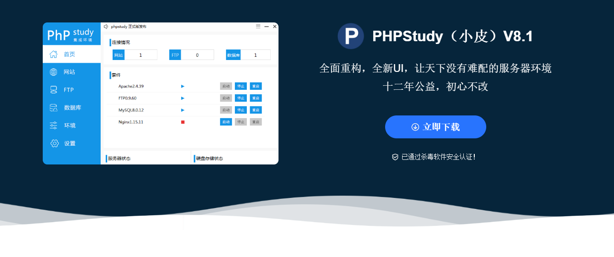
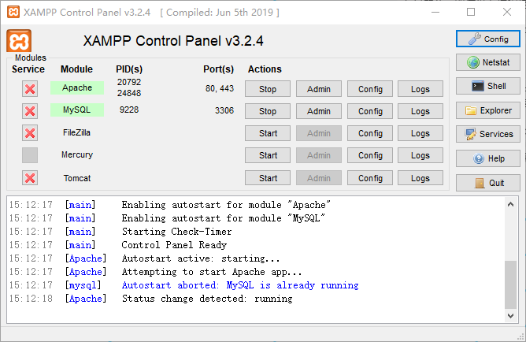

# php 入门

## 什么是 php

> PHP（“PHP: Hypertext Preprocessor”，超文本预处理器的字母缩写）是一种被广泛应用的开放源代码的多用途脚本语言，它可嵌入到 HTML 中，尤其适合 web 开发

## 特征:

- PHP 是一门语言，服务器端的脚本语言
- 适合开发 WEB，实现功能

## php 环境搭建

### phpstudy

### xampp

::: tip 总结

这里推荐使用 phpstudy,国人开发,十分完善,建议使用

:::

## 

## for循环

for循环和javascript 中的定义一致,基本用法大致相同.

## break

break表示中断循环的进行,

## continue

continue 表示跳过当前的条件,继续执行下一个条件,

