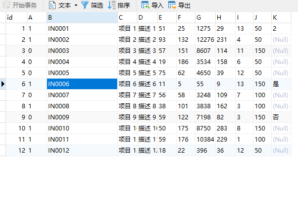

# php 读取 excel

> 参考文档:[https://www.cnblogs.com/makalochen/p/12834440.html)

# 效果



# 安装必要插件

```
composer require phpoffice/phpexcel
```

## 引入包

```
use PHPExcel_IOFactory;
```

## 初始化读取文件

```php
objExcel = PHPExcel_IOFactory::load(public_path() . '/static/shuju.xlsx');
```

## 获取表信息

```php
读取表中的第一个工作表
$currentSheet = $objExcel->getSheet(1);

$ac = $currentSheet->getHighestColumn(); // 获取最大列
$ar = $currentSheet->getHighestRow();// 获取最大行数
```

## 定义每行的单元名称

```php
$info = [
            "A" => "续订",
            "B" => "库存 ID",
            "C" => "名称",
            "D" => "描述",
            "E" => "单位价格",
            "F" => "在库数量",
            "G" => "库存价值",
            "H" => "续订水平",
            "I" => "续订时间(天)",
            "J" => "续订数量",
            "K" => "是否已停产？"
        ];

 $data = []; // 存储数据
```

## 循环读取文件

```php
   for ($a = 2; $a <= $ar; $a++) {
            $column = [];
            for ($i = 'A'; $i <= $ac; $i++) {
//   $column[$info[$i]]=$currentSheet->getCell($i.$a)->getValue();
                $column[$i] = $currentSheet->getCell($i . $a)->getValue();
            }


//            dump($column);
            $data[] = $column;

        }

```

## 批量插入数据

```php
 $results = Db::table('test')->insertAll($data);
```

# 主要的几个类库和 API

```php
（1）PHPExcel：工作簿对象

    excel文档处理对象主要用来管理我们的excel文档，怎么来管理（通过属性和方法来管理）？大家知道，类主要是由属性和方法来组成，通过php程序的手段来管理excel文档，其实就是通过本对象的属性和方法来管理，下面我们就来看一下PHPExcel类中都有那些属性和方法，这些属性和方法主要用来管理excel文档的那些方面

    getProperties()：获得当前活动状态工作表的属性对象，返回属性对象
    getActiveSheet()：获得当前活动状态的工作表，返回工作表对象
    getActiveSheetIndex()：获得当前活动状态工作表的索引值，返回int
    setActiveSheetIndex()：设置当前活动状态工作表的索引，返回工作表对象
    getSheetByName()：通过工作表名称得到当前工作表对象，返回工作表对象
    getDefaultStyle()：获得excel文档默认的样式（所有工作表的样式），返回样式对象
    createSheet():在当前活动工作表后创建一个新的工作表
    getSheetCount()：获得excel文档中工作表的数量，返回int
    getSheetNames()：获得excel文档中所有工作表名称组成的数组

（2）PHPExcel_Worksheet：工作表对象

    工作表对象，主要用来管理我们的工作表，怎么管理？也是通过属性和方法来管理，但是工作表对象大部分情况下可通过excel文档对象来获取


    toArray()：把工作表中的数据转换成数组
    fromArray():从数组中获取数据填充到工作表，返回工作表对象
    getCell()：获得单元格对象
    getCellByColumnAndRow()：通过列索引和行索引获得指定单元格，返回单元格对象
    getDefaultStyle()：获得工作表默认的样式，返回样式对象
    getHighestColumn()：获得工作表的最大列，返回列的名称
    getColumnDimension():获得当前列
    getStyle():获得指定单元格的样式，返回样式对象
    getParent()：获得父类对象，返回excel文档对象
    getTitle()：获得工作表的标题或名称，返回字符串类型
    setCellValue():设置单元格的值，返回工作表对象或单元格对象，完全取决于参数的值
    setCellValueByColumnAndRow()：通过列索引和行索引设置单元格的值，返回类型同上
    setCellValueExplicit()：设置单元格的值，并显示指定数据类型，返回工作表对象
    setCellValueExplicitByColumnAndRow()：通过列和行索引设置单元格值
    setTitle():设置工作表标题

（3）PHPExcel_Cell:单元格对象

（3）PHPExcel_Style：样式对象，主要用来设置单元格的样式：对齐方式、字体、边框、填充等，跟我们之前学过的css样式差不多，在这里如果想要设置对齐方式、字体大小、边框颜色、等等都是通过样式对象来完成的

    getActiveCell()：获得当前活动的单元格的名称，返回string；如，A1
    getActiveSheet()：获得当前活动的工作表，返回工作表对象
    getAlignment()：获得对齐方式对象，返回对齐方式对象
    getBorders()：获得边框对象，返回边框对象
    getFill()：获得填充对象
    getFont()：获得字体对象
    setFont()：设置字体，返回样式对象

（3）PHPExcel_Style_Alignment：对齐方式对象


    getHorizontal()：获得水平居中方式
    getVertical()：获得垂直居中方式
    setHorizontal()：设置水平居中方式，返回对齐方式对象
    setVertical()：设置垂直居中方式，返回对齐方式对象

    居中方式：
        HORIZONTAL_CENTER
        HORIZONTAL_CENTER_CONTINUOUS
        HORIZONTAL_GENERAL
        HORIZONTAL_JUSTIFY
        HORIZONTAL_LEFT
        HORIZONTAL_RIGHT
        VERTICAL_BOTTOM
        VERTICAL_CENTER
        VERTICAL_JUSTIFY
        VERTICAL_TOP

（3）PHPExcel_Style_Font：字体对象

    setBold（）：设置字体加粗
    setColor（）：设置字体颜色
    setItalic（）：设置字体倾斜
    setName（）：设置字体名
    setSize（）：设置字体大小
    setUnderline（）：设置字体下划线

（4）PHPExcel_Writer_Excel5：写操作对象，主要用来输出xls文件

    save(工作簿文件名)：将工作簿对象中的数据保存到一个工作簿文件中

（4）PHPExcel_Writer_Excel2007：写操作对象，主要用于输出xlsx文件

    save(工作簿文件名)：将工作簿对象中的数据保存到一个工作簿文件中

（5）PHPExcel_Reader_Excel5：读操作对象，主要用于输入xls文件

    canRead():当前reader对象是否能够读工作簿文件
    load():从一个工作簿文件中加载工作簿对象，也就是将工作簿文件中的数据加载到工作簿对象中来管理

（6）PHPExcel_IOFactory：读写操作对象

    createReader()：根据参数的不同，创建不同的读对象：主要作用是读取工作簿文件中的数据

    createWriter()：根据参数的不同，返回不同的写对象：主要作用是将PHPExcel工作簿对象中的数据写入到一个工作簿文件中

    load():从工作簿文件中加载PHPExcel工作簿对象，即：将工作簿文件中数据加载到PHPExcel工作簿对象中来管理


PHPExcel对象：是一个工作簿对象

include_once "PHPExcel/Writer/Excel5.php";//主要用于其它低版本，且文件名后缀为xls的文件，如果我们希望生成后缀名为xls格式的excel文件，建议引入此类库

include_once "PHPExcel/Writer/Excel2007.php";//主要用于excel2007格式，文件名后缀为xlsx的excel文件，如果我们希望生成后缀名为xlsx格式的excel文件，建议引入此类库

$objWriter = new PHPExcel_Writer_Excel5($objExcel);//创建一个文件格式写入对象实例，此对象主要用来写入内容到指定格式的文件，如，写入内容到后缀名为xls格式的excel文件等，用于其它板式的格式

$objWriter = new PHPExcel_Writer_Excel2007($objExcel);//创建一个文件格式写入对象实例，此对象主要用来写入内容到指定格式的文件，如，写入内容到后缀名为xls格式的excel文件等，用于excel2007格式
$objWriter->setOffice2003Compatibility(true);//兼容office2003


//设置文档基本属性
$objProps = $objExcel->getProperties();  //得到PHPExcel_document文档对象
$objProps->setCreator("Zeal Li");       //设置作者
$objProps->setLastModifiedBy("Zeal Li"); //设置最后修改时间
$objProps->setTitle("Office XLS Test Document"); //设置标题
$objProps->setSubject("Office XLS Test Document, Demo");//设置主题
$objProps->setDescription("Test document, generated by PHPExcel.");//描
$objProps->setKeywords("office excel PHPExcel"); //关键字
$objProps->setCategory("Test"); //分类


$objExcel->setActiveSheetIndex(0);//设置用户打开excel文件时，看到的首张sheet，如果没有设置，默认为最后一次操作的sheet

$objActSheet->setTitle('测试Sheet');//设置当前活动的工作簿名称


//根据单元格名称设置单元格内容，由PHPExcel根据传入的内容自动判断单元格的内容类型
$objActSheet->setCellValue('A1', '字符串内容');  // 字符串内容
$objActSheet->setCellValue('A2', 26);            // 数值
$objActSheet->setCellValue('A3', true);          // 布尔值
$objActSheet->setCellValue('A4', '=SUM(A2:A2)'); // 公式

/显式指定单元格的内容类型为字符串类型
$objActSheet->setCellValueExplicit('A5','847475847857487584',PHPExcel_Cell_DataType::TYPE_STRING);

//合并单元格
$objActSheet->mergeCells('B1:C22');


//设置列的宽度
$objActSheet->getColumnDimension('B')->setAutoSize(true);
$objActSheet->getColumnDimension('A')->setWidth(30);

//设置行的高度
$objPHPExcel->getActiveSheet()->getRowDimension('2')->setRowHeight(11.5);


//格式：主要用来对单元格进行操作，如，设置字体、设置对齐方式、设置边框等
$objStyleA5 = $objActSheet->getStyle('A5');//获取A5单元格的样式

//设置单元格的字体
$objFontA5 = $objStyleA5->getFont(); //获得字体
$objFontA5->setName('宋体');//设置字体名称
$objFontA5->setSize(10);  //设置字体大小
$objFontA5->setBold(true);//设置字体加粗
$objFontA5->getColor()->setARGB('FF999999');//设置字体颜色

//设置单元格的对齐方式
$objAlignA5 = $objStyleA5->getAlignment();//获得对齐方式
$objAlignA5->setHorizontal(PHPExcel_Style_Alignment::HORIZONTAL_RIGHT);//水平居右
$objAlignA5->setVertical(PHPExcel_Style_Alignment::VERTICAL_CENTER);//垂直居中

//设置单元格的边框
$objBorderA5 = $objStyleA5->getBorders();//获取边框
$objBorderA5->getTop()->setBorderStyle(PHPExcel_Style_Border::BORDER_THIN);//边框样式
$objBorderA5->getTop()->getColor()->setARGB('FFFF0000');//顶部边框的颜色
$objBorderA5->getBottom()->setBorderStyle(PHPExcel_Style_Border::BORDER_THIN);
$objBorderA5->getLeft()->setBorderStyle(PHPExcel_Style_Border::BORDER_THIN);//左样式
$objBorderA5->getRight()->setBorderStyle(PHPExcel_Style_Border::BORDER_THIN);//右样式

//设置单元格的填充色
$objFillA5 = $objStyleA5->getFill();//填充
$objFillA5->setFillType(PHPExcel_Style_Fill::FILL_SOLID);//填充类型
$objFillA5->getStartColor()->setARGB('FFEEEEEE');

//计算单元格的值
$objPHPExcel->getActiveSheet()->setCellValue('B7', '=SUM(B5:C5)');
$objPHPExcel->getActiveSheet()->getCell('B7')->getCalculatedValue();
//如果要获取单元格的一个值,首先需要通过工作表的getCell方法获取到一个单元格对象，然后再通过单元格对象的getValue方法得到单元格的值，如果单元格的值是通过计算得到的，则需要使用getCalculatedValue方法获取单元格的值，设置单元格的值，我们只需要通过工作表的setCellValue方法来设置即可


//$dateTimeNow=time();
$objPHPExcel->getActiveSheet()->setCellValue('C10', PHPExcel_Shared_Date::PHPToExcel( $dateTimeNow ));//41105.75

$objPHPExcel->getActiveSheet()->getStyle('C10')->getNumberFormat()->setFormatCode(PHPExcel_Style_NumberFormat::FORMAT_DATE_TIME4);//18:00:54,只是换了一种显示方式，并不会改变原来值的类型

echo gettype($objPHPExcel->getActiveSheet()->getCell('C10')->getValue());//double
echo $objPHPExcel->getActiveSheet()->getCell('C10')->getValue();//41105.75

//'2010-10-21'一定要放在引号中，否则显示的值为，1979               文本（推荐）
$objPHPExcel->setActiveSheetIndex(0)->setCellValueExplicit("D1", '2010-10-21', PHPExcel_Cell_DataType::TYPE_STRING); //特征：字符串类型都是居左显示

//添加一个新的worksheet
$objExcel->createSheet();//创建一个新的工作表
$objExcel->getSheet(1)->setTitle('测试2');//设置当前工作表的标题

//保护单元格
$objExcel->getSheet(1)->getProtection()->setSheet(true);
$objExcel->getSheet(1)->protectCells('A1:C22', 'PHPExcel');

//输出内容到excel文件，并将文件保存在服务器上
$objWriter->save("test.xls");

//强制输出内容到浏览器下载
header("Content-Type: application/force-download");
header("Content-Type: application/octet-stream");
header("Content-Type: application/download");
header('Content-Disposition:inline;filename="'.$outputFileName.'"');
header("Content-Transfer-Encoding: binary");
header("Expires: Mon, 26 Jul 1997 05:00:00 GMT");
header("Last-Modified: " . gmdate("D, d M Y H:i:s") . " GMT");
header("Cache-Control: must-revalidate, post-check=0, pre-check=0");
header("Pragma: no-cache");
$objWriter->save('php://output');//参数-表示直接输出到浏览器，供客户端下载

//excel读取对象
$PHPReader = new PHPExcel_Reader_Excel5();//创建一个excel文件的读取对象
$PHPExcel = $PHPReader->load($filePath);//读取一张excel表，返回excel文件对象
$currentSheet = $PHPExcel->getSheet(0);//读取excel文件中的第一张工作表
$allColumn = $currentSheet->getHighestColumn();//取得当前工作表最大的列号,如，E
$allRow = $currentSheet->getHighestRow();//取得当前工作表一共有多少行

//设置工作簿默认的样式
$objPHPExcel->getDefaultStyle()->getFont()->setName('Arial');
$objPHPExcel->getDefaultStyle()->getFont()->setSize(8);

//合并单元格
$objPHPExcel->getActiveSheet()->mergeCells('A18:E22');

```

# 其他操作

## 读取 excel 相关的操作函数

```php
//创建excel读对象
$reader = PHPExcel_IOFactory::createReader('Excel5');
//or
$reader = new PHPExcel_Reader_Excel5();
//得到excel操作对象
$excel = PHPExcel_IOFactory::load(excel路径);
//or
$excel = $reader->load(excel路径);

//获取表的相应数据

//获取工作表数量
$excel->getSheetCount();

//获取工作表名
$excel->getSheetNames();

//根据表名切换当前工作表
$excel->setActiveSheetIndexByName();

//获取整个内容返回数组
$excel->getActiveSheet()->toArray();

//通过reader对象获取excel表的信息
$reader->listWorkSheetInfo(路径);
$reader->listWorkSheetNames(路径);

//获取当前工作表最大行数
$excel->getActiveSheet()->getHighestRow();
//获取当前工作表最大列数
$excel->getActiveSheet()->getHighestColumn();

//获取单个单元格内容
$curSheet->getCell('A1')->getValue();

```

## 单元格的合并、多行多列合并、插入行、删除行、插入列、删除列

```php
<?php
//引入PHPExcel文件
require './Classes/PHPExcel.php';

//1.文件的创建
//创建PHPExcel对象
$obj = new PHPExcel();

//创建excel文件写入对象
$writer = new PHPExcel_Writer_Excel5($obj);

//操作工作表(worksheet)
//创建工作表方法一
$sheet = new PHPExcel_Worksheet($obj, 'new sheet');
$obj->addSheet($sheet);
//创建工作表方法二
$obj->createSheet();

//设置当前工作表,也就是excel从左往右，从0开始
$obj->setActiveSheetIndex(0);
//得到当前工作表对象
$curSheet = $obj->getActiveSheet();
//往工作表中插入数据

//设置单元格的值
$curSheet->setCellValue('A1', '10');
$curSheet->setCellValue('A2', '20');
$curSheet->setCellValue('A3', '=sum(A1:A2)');

//单元格的合并
$curSheet->mergeCells('A1:A3');
//多行多列合并
$col1 = 2;//第三列
$row1 = 2;//第三行
$col2 = 3;//第四列
$row2 = 3;//第四行
$curSheet->mergeCellsByColumnAndRow($col1,$row1,$col2,$row2);
//插入一行(在before之前插入$rowNums行)
$curSheet->insertNewRowBefore($before=1, $rowNums=1);
//删除行(从row开始删除$rowNums行)
$curSheet->removeRow($row=1,$rowNums=1);
//插入列(在before之前添加$colNums列)
$curSheet->insertNewColumnBefore($before='A', $colNums=1);
//删除列(从col开始删除$colNums列)
$curSheet->removeColumn($col='A', $colNums);

ob_end_clean();
//浏览器输出
header('Content-Type: application/vnd.ms-execl');
header('Content-Disposition: attachment;filename="测试合并-插入-删除.xls"');
header('Cache-Control: max-age=0');
$writer->save('php://output');

?>

```

## 插入图片

```php
<?php
//引入PHPExcel文件
require './Classes/PHPExcel.php';

//1.文件的创建
//创建PHPExcel对象
$obj = new PHPExcel();

//创建excel文件写入对象
$writer = new PHPExcel_Writer_Excel5($obj);

//操作工作表(worksheet)
//创建工作表方法一
$sheet = new PHPExcel_Worksheet($obj, 'new sheet');
$obj->addSheet($sheet);
//创建工作表方法二
$obj->createSheet();

//设置当前工作表,也就是excel从左往右，从0开始
$obj->setActiveSheetIndex(0);
//得到当前工作表对象
$curSheet = $obj->getActiveSheet();
//往工作表中插入数据

//插入图片
// 1、创建图片操作对象
$img = new PHPExcel_Worksheet_Drawing();
// 2、设置图片路径
$img->setPath("./1.jpg");
// 3、设置图片宽高
$img->setWidth(533);
$img->setHeight(533);
// 4、设置图片插入位置
$img->setCoordinates('A1');
// 5、设置图片偏移量
$img->setOffsetX(100);
// 6、设置图片倾斜
$img->setRotation(25);
// 7、添加到工作表
$img->setWorksheet($curSheet);

ob_end_clean();
//浏览器输出
header('Content-Type: application/vnd.ms-execl');
header('Content-Disposition: attachment;filename="测试插入图片.xls"');
header('Cache-Control: max-age=0');
$writer->save('php://output');

?>

```
