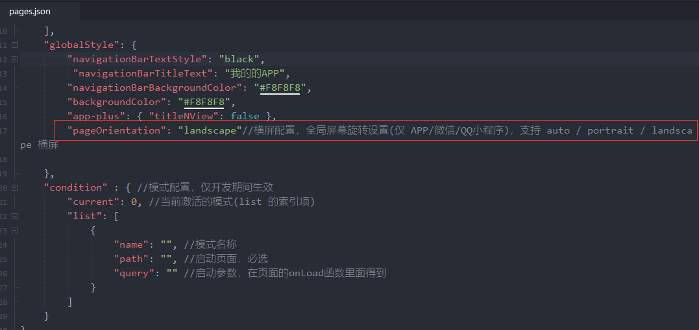
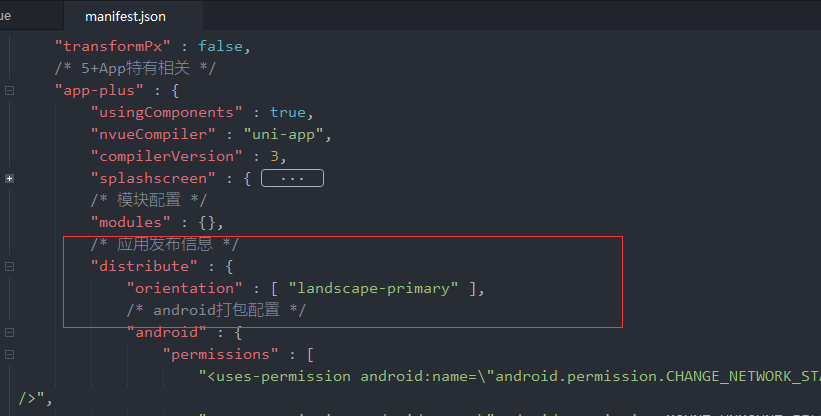
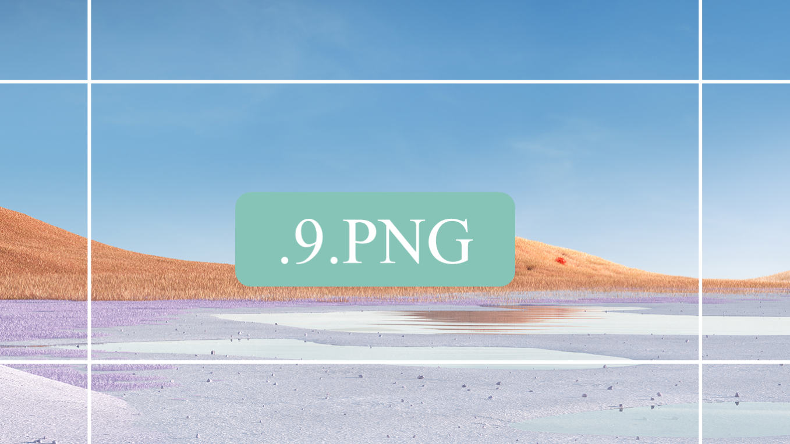
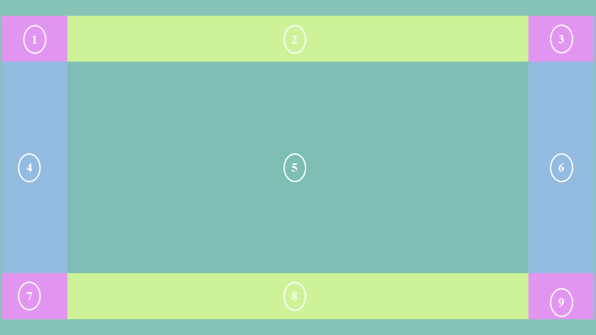
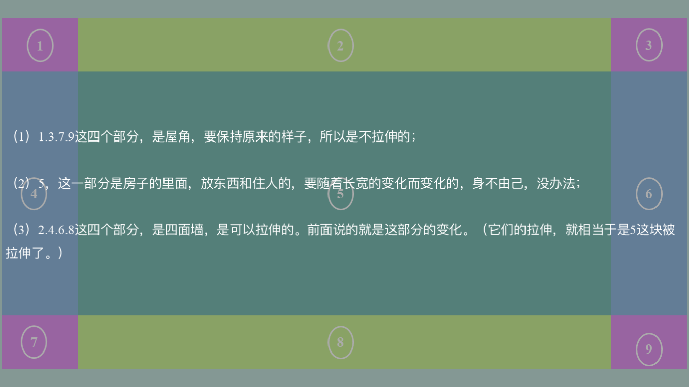
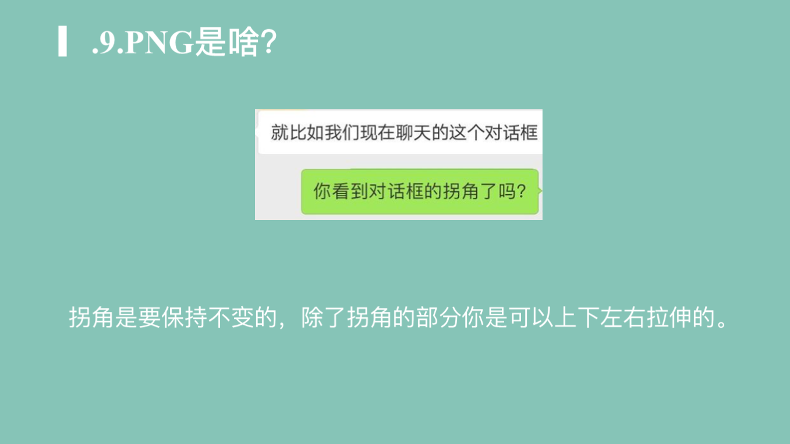
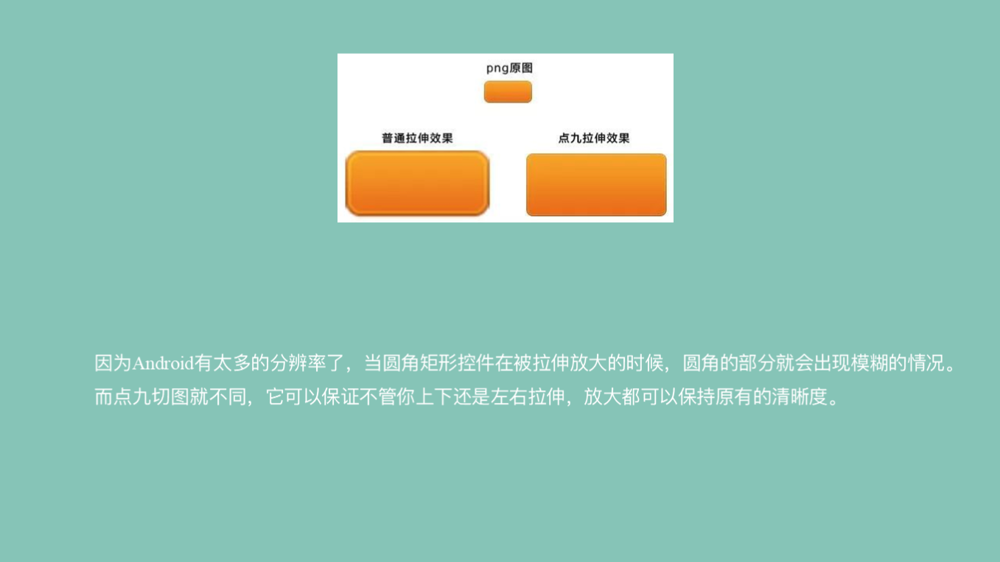
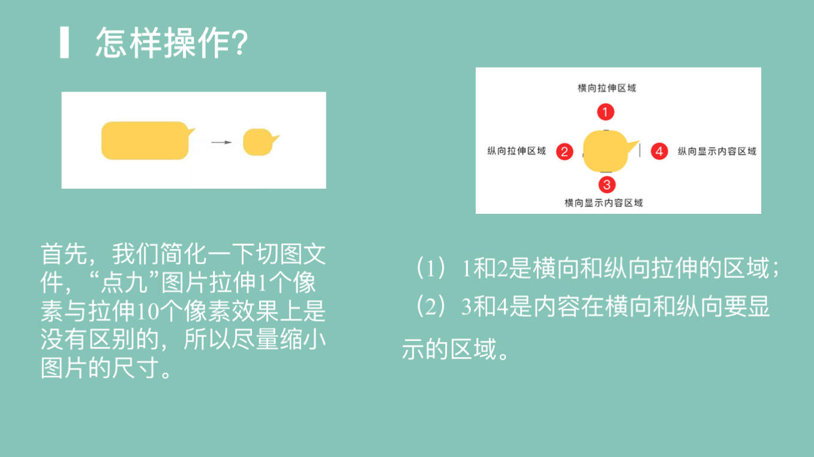
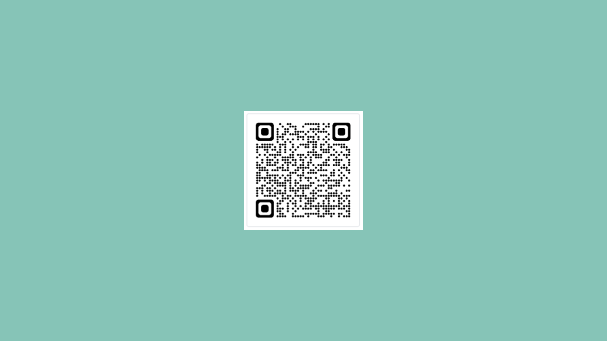

# 横屏实现思路


> uniapp 开发横屏配置的几个设置参数 

## 1.page.json





```json
"pageOrientation": "landscape"
//横屏配置，全局屏幕旋转设置(仅 APP/微信/QQ小程序)，支持 auto / portrait 竖屏 / landscape 横屏
```

## 2.APP.VUE


```js
<script>
	export default {
		onLaunch: function() {
			console.log('App Launch')
			//#ifdef APP-PLUS
			plus.screen.lockOrientation('landscape-primary'); //锁定横屏模式
			//#endif

		},
		onShow: function() {
			console.log('App Show')
			//#ifdef APP-PLUS
			  plus.navigator.setFullscreen(true);
			  //#endif
		},
		onHide: function() {
			console.log('App Hide')
			//#ifdef APP-PLUS
			plus.navigator.setFullscreen(false);
			//#endif
		}
	}
</script>

<style>
	/*每个页面公共css */
</style>

```

## 3.manifest.json 

打开`manifest.json`源码视图,`app-plus`下的配置:



```js
 "orientation" : [ "landscape-primary" ], //  强制横屏
     
 "orientation" : ["portrait-primary" ] //重力感应、横竖屏配置

// 
 
```


# 补充知识

## 横屏启动图.9png















