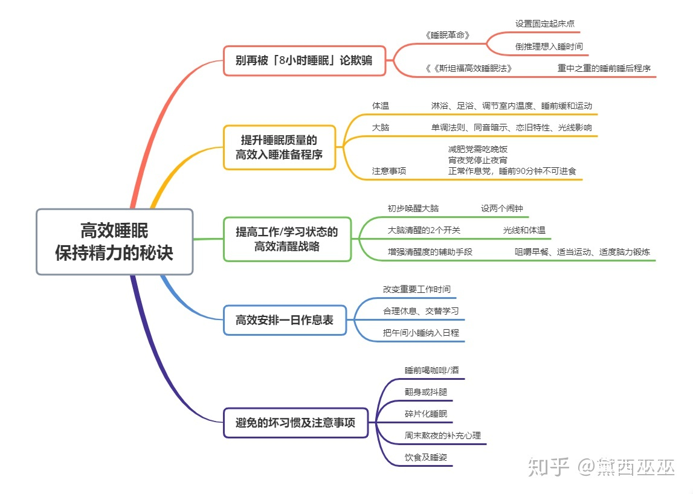
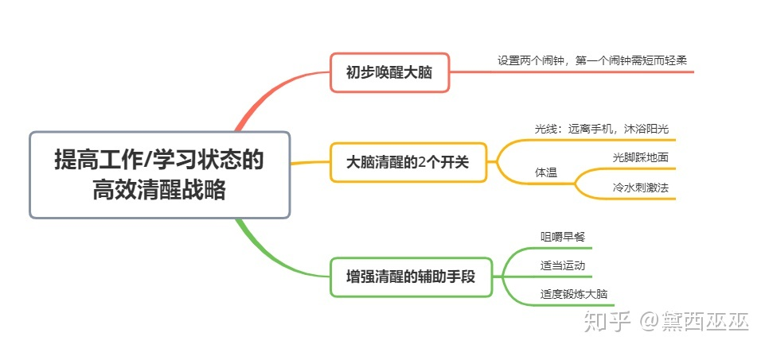
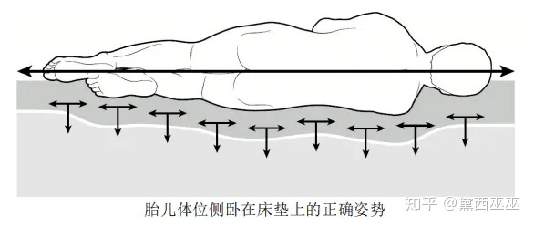
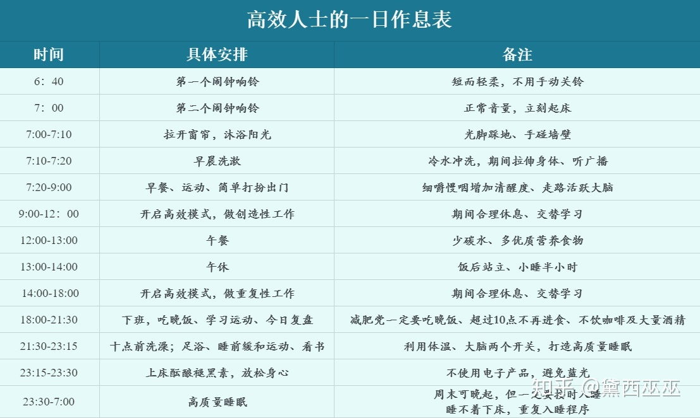
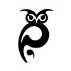

# 如何每天只睡 6 小时，还保持一整天都精力充沛？

> 来自知乎:https://www.zhihu.com/question/379478413/answer/1102999850

我特别懂睡不好的痛苦。有段时间我 11 点上床，辗转反侧到凌晨 2 点都没睡着，每天醒来头昏脑涨、眼睛又干又涩，一天状态特别差劲，效率低得可怜。

后来我翻阅研究了很多关于睡眠的资料和书籍，还结合了两本睡眠神书：《睡眠革命》和《斯坦福高效睡眠法》的技巧和方法，**让我的睡眠质量得到了质的飞跃，**从此走上逆袭之路。

方法很简单，实操性很强，只要按着步骤来，你也能学会高效休息，让睡眠赢在起跑线上，用好状态从各方面开挂~

**本文 5800 字，需要花费你 5-8 分钟阅读，却可能会让你受益 50-80 年。**敲了三个晚上，相信我，这是你最容易能做到的自律方法。接下来请挺住腰板，认真看文，开课啦~

**一、别再被「8 小时睡眠论」欺骗**
--------------------

我们一直认为，每天睡够 8 小时、10 点睡 6 点起，才能身体倍儿棒精神爽。

黛西现在来纠正你：**这个言论是错误的！**

每个人的生物钟不同，所谓的 8 小时只是睡眠平均数值，有人只睡 4 小时、也有人要睡 10 小时，才能精神饱满，**找到适合自己的睡眠时间，才是重中之重。**

如同中岛孝志所说：

“睡眠的质量不应该用时间标准去衡量，而是应该根据熟睡了多久，醒的时候是否神清气爽来判断，质比量重要，关键是自己舒不舒服。”

**划重点：睡眠的时间长度不是最重要的，睡眠质量才是！**

**睡眠质量好，能让大脑保持清醒，思维变得敏捷。**睡眠不好，不单单只是效率低下的问题，更会引起糖尿病、肥胖、老年痴呆等病症。

如果你不想秃头又变笨变丑的话，就仔细看下面这两本睡眠神书的**核心内容和操作方法**，书本比较啰嗦，我已经帮你提炼出重点，可以即看即用哦~

**《睡眠革命》：**

**根据 R90 方案，制定最佳的入睡和起床时间。**

R90 方案为 90 分钟一个睡眠周期，一般人一天只需 4-5 个睡眠周期（6-7.5 个小时），一周在 28-35 周期内。只要按照完整的周期，就能得到高质量的睡眠。

书中提到：如果你并不需要每晚 8 小时的睡眠，但却在自己不困的时候，或者躺在床上也睡不着的时候，强迫自己睡足 8 小时，那么就是在浪费时间。

不是睡越久越好，作者说过，他的客户每天睡 7.5 小时，特别没精神，缩减一周期变成 6 个小时，反而精神百倍。不要盲目跟从自律人士的作息，**找到适合自己生物钟的作息，才是最重要的事。**

**《斯坦福高效睡眠法》：**

**根据睡前睡后的程序，打造高质量睡眠，造就高效状态。**

**此书的重点，是让我们利用好最关键的睡眠第一周期。**

第一个周期的 90-120 分钟，是身体释放压力、排泄毒素的最有效时间，只要保证第一周期睡得好，即使睡得短也能精力充沛，头脑清醒跟充了电一样。

**如果第一周期没睡好，睡得再久也没用，起来还是腰酸背痛、眼睛干涩。**这就是我们偶尔睡得少但精神饱满，有时躺一天，却头脑昏沉浑身不舒服的原因。

**现在我将结合两本书的优质方法，顺序系统化，一步步讲解操作步骤，准备记笔记啦！**

**第一步：设定固定起床点**

选择必须起床的最早时间，最好是比上班 / 学时间提前 90 分钟，保证睡醒有充分时间缓冲状态，不耽误任何事情。

**第二步：倒推理想入眠期**

用固定起床时间倒推入睡时间，刚开始用 5 个周期倒推，之后根据起床状态不停尝试，多退少补，慢慢找到专属自己的作息表。

比如 7 点起床，往前倒推 5 个周期，是 23:30 入睡，需要早些到床上酝酿睡眠状态，就要 23：15 左右上床。

如果 7 点醒来觉得精神，可减少 1 周期，变成五点半起床；反之增加 1 周期，提前入睡时间（22:00）或延迟起床时间（8：30）。

注意，入睡时间不要太晚，不要熬夜！根据昼夜节律，身体在 21 点分泌褪黑素，2-3 点达到睡眠最深的状态，千万别错过这个黄金睡眠阶段。

**第三步：重中之重的睡前睡后程序**

**这一步特别重要，**如果没做好，就算你找到属于自己的生物钟也没用。因为优质的睡前睡后程序，不仅能极大改善睡眠质量，还可以保证第二天的精神状态和新陈代解。

接下来的内容是文章的重头戏，我分为「**入睡准备**」和「**高效清醒**」两大部分详细详解，**建议看之前点赞 + 收藏，**方便失眠时，能找到文章根据相应方法，迅速入睡哦~

**二、高效入睡的准备程序**
---------------

《斯坦福高效睡眠法》里提到，想要打造最佳的睡眠质量，需调节控制人体的两大机关——**体温和大脑**，这简单的四个字，能在很大程度解决你睡不好或失眠的现状！

### **1）关于体温**

**调节体温的关键，在于缩小「人体表内」的温度差。**

临近睡觉时，我们的「体内温度」会下降，想缩小温度差，就要通过物理方法散发热量，让「体表温度」也跟着下降，温差越小，睡意越浓，如下图。

针对这种现象，我结合书中方法，总结 4 种调节体温，提高睡眠质量的方法：

**体温开关 1：入睡前 90 分钟淋浴**

体温上升得快，下降得也快，洗完热水澡后，从温暖到凉爽的环境切换中，身体会降低「**体表温度**」，使身体「**表内**」减少温度差，从而有了困意。

操作方法：如果 23:30 点睡觉，则在 22 点前结束沐浴，22 点 15 分钟左右上床，通过 15 分钟的睡前准备，还有 1 小时左右的睡前阅读、睡前瑜伽等不带刺激大脑的日常安排，到了快 11 点时，保证你能快速入眠，睡得香香的~

**体温开关 2：足浴**

这是作者一再推荐的方法，也是最容易操作的，黛西自己坚持泡脚好几年，真的很受用。

通过热水促进脚部血液循环，极快提高体温、散发热量，帮助入睡。（ps：时间不要超过 15 分钟，会适得其反）

泡脚时下载你的一天，进行**复盘**，把今日收获或压力，记录下来，让成果可视化；顺便制作明日计划，让第二天有方向感地度过。

**这里真的特别建议同学们都能养成复盘的好习惯，持续性复盘反思，才能形成正向反馈。**学习不是喊口号，核心是对所学知识的最大程度吸收，而复盘是你最佳的思维辅助工具。黛西坚持复盘 5 年了，不论生活上还是工作上，都有了极高质量的提升。

另外，经过长时间不断研究琢磨，**我整理出一套独家复盘方法，它让我的学习工作效率都提升了 2 倍以上**，关注我的公众号**「黛西巫巫」**，你就能同我一起分享啦，希望你们都能做到长期坚持噢~

[敢对自己狠的女生，到底有多赚？​mp.weixin.qq.com](https://mp.weixin.qq.com/s/F74PoEoFGS6mHAwFLZjbPQ?WECHAT_ID=%E9%BB%9B%E8%A5%BF%E5%B7%AB%E5%B7%AB&BIZ=ECOMMERCE)

**体温开关 3：调节室内温度**

科学研究表示，房间温度在 20-25 度时，身体感觉最舒服，最适合入睡。

**体温开关 4：睡前缓和运动**

睡前做些不用动脑，又能让身体发热的运动，有利于放松身体，提高睡眠质量。例如：瑜伽类的舒展运动、整理房间。

黛西洗完澡后，会做周六野老师的斜方肌运动，只要 10 分钟，能拉伸肩颈，缓冲久坐带来的肌肉紧绷感，做完感觉特别舒服。

而且视频配乐轻柔、老师声音甜美，听着心情都变好了，强烈安利给你们！

没做过的同学，先看第一个视频上课，up 主讲解了生活中容易加重肩颈问题的细节，后期看第二个做运动，比较方便~

### **2）关于大脑**

**大脑开关 1：单调法则**

睡前冥想有利于放空大脑，提高专注力，让紧绷的神经松懈下来，助于睡眠。

也可看较为枯燥单调的东西，比如：书、无聊的节目。一定不要看刺激性电影或视频等，会造成反作用，让大脑越来越兴奋，错过黄金睡眠期。

黛西一直坚持睡前冥想 + 看书，能放慢呼吸，释放压力，每天都睡得倍儿棒~

**大脑开关 2：同音暗示**

外国人通过数羊入睡，是因为同谐音的心理暗示，sheep-sleep，再加上单调法则去催眠大脑。

我们则可以用 “水饺” 催眠，诱导大脑去睡觉。（希望你不要饿了哈哈）

**大脑开关 3：恋旧特性**

认床现象是因为大脑恋旧，喜欢熟悉的东西，在熟悉环境更能快速入睡。

因此可在同一张床、同一时间、同一睡衣、同一室温环境下睡觉；有睡前听音乐的同学，可以选择同一首单调的轻音乐，帮助入眠。

记住，最好是不要有嘈杂音的轻音乐，黛西平常听着缓和的轻音乐入睡时，情绪都会变得非常平和，头部也有一种神经绷紧后放松的舒缓感。**如果你也想听音乐助眠的话，可以关注我的公众号「黛西巫巫」，我这有超适合睡前听的轻音乐，以及一些睡眠提升书籍，想分享给你，它们都是我亲测有效的入眠好帮手，愿你今夜好眠哟~**

[敢对自己狠的女生，到底有多赚？​mp.weixin.qq.com](https://mp.weixin.qq.com/s/F74PoEoFGS6mHAwFLZjbPQ?WECHAT_ID=%E9%BB%9B%E8%A5%BF%E5%B7%AB%E5%B7%AB&BIZ=ECOMMERCE)

**大脑开关 4：光线影响**

睡觉前从白灯变成暖灯。昏暗环境更容易舒缓大脑，让呼吸、节奏都慢下来，产生困意。

**一定要避免蓝光，**手机或平板等电子产品，极容易产生蓝光，更不要去刷抖音刷微博看精彩电影。

**最好的办法就是不带手机上床，**曾看过一句很形象的话**：**

让手机单独一个屋睡，手机已经到了和大人分开睡的年龄了，不要再宠幸它了，会惯坏的。

**但你可以宠黛西，惯坏我也没事哈哈，喜欢我的话，记得点个赞哦~**

### **3）注意事项**

**除了体温和大脑外，黛西特别提出一点：**

减肥的同学，晚上一定要吃饭。一是不吃晚饭会睡得浅、影响睡眠，睡眠不好，会越减越肥！二是长期胃酸过多，会引起胃病。

黛西也会控制饮食保持身材，最好的办法就是晚上吃优质碳水 + 绿色蔬菜及蛋白质，如：地瓜、玉米、糙米等。既能保持健康达到瘦身目的，又能保证睡眠质量，双赢啊。

另外，宵夜党停止罪恶的双手，超过 **10 点**后不再吃东西；正常作息的人，睡前 **90 分钟**不再进食。

过晚进食会让食物堆砌，在入睡期间，肠道需要损耗能量、消化食物，让睡眠质量下降，消化不完，就会引起肥胖，得不偿失。

为方便大家理解，放个分块总结图：

以上的睡前习惯，能让你的睡眠质量达到空前绝后的状态，睡得少又能睡得好，这是迈进优秀圈的第一步。

**三、高效清醒战略**
------------

文章前面说过，**我们的起床时间最好是比上班 / 学时间提前 90 分钟，保证睡醒有充分时间驱赶睡意，**七点起来和 8 点半起来，状态是完全不相同的，睡晚后抓个面包就急跑到公司的匆忙，会影响一天的效率。

**高质量的睡后习惯很重要，**能让你拥有高效状态，去投入一天的工作和学习，产生比平时高 2-3 倍的效益。方法很简单，做到下面几个步骤，你也能像自律人士，轻松掌控早晨：

### **1）定两个闹钟**

设置两个闹钟，初步唤醒大脑，接收起床信号。

如果 7 点起床，就设置间隔 20 分钟的两个闹钟（例如 6：40 和 7：00），第一闹钟轻而短，能不用手动关闹钟，让大脑初醒；第二个正常音量，起身关掉下床。

**亲测有用！**

这样做的效果，比 10 分钟一次的贪睡闹钟更好，更能让人接受起床过程。

### **2）关于光线**

想要增强大脑清醒度，同样需要两个开关——光线和体温。

醒来第一时间不要看手机，远离诱惑睡眠的罪恶地，**立刻马上下床拉开窗帘，**沐浴阳光时伸个大大的懒腰，作为迎接新一天的仪式。

### **3）关于体温**

**体温开关 1：光脚踩地面或手触碰墙壁**

能够刺激大脑、收缩足部 / 手部血管，导致体表温度下降，让人清醒。

**体温开关 2：冷水刺激法**

用冷水刷牙、洗手，带来皮肤的刺激感，这个方法在冬天效果更佳明显。

黛西刷牙期间会拉伸下老胳膊老腿，让身体跟着醒过来。

### **4）饮食习惯**

不吃早餐更容易发胖，让中午食欲大增，进而暴饮暴食，为了身体健康，一定要吃早餐。

另外，最好保持细嚼慢咽的习惯，一能通过咀嚼强化大脑清醒度，二让大脑更精准接收到，身体吃饱的信号。

### **5）适当运动**

避免出汗运动，会使精力快速削减；可以通过走路、拉伸等运动，适当活跃大脑，产生好状态。

现在就是你适当运动的时候了，活动下手指双击屏幕吧，嘻嘻~

### **6）适度锻炼大脑**

起床后循环渐进地开发大脑，可以多听广播、新闻、书籍音频。

黛西会从洗漱到早餐这段时间播放广播，让大脑先动起来，为专注工作提前预热状态。

同样，分块总结图：

**四、高效安排一日作息表**
---------------

好睡眠能造就高效状态，同样，高效状态也能造就高质量睡眠。

白天过得充实，将体力和大脑发挥到效益最大化，晚上自然累得安然入睡。

**但安排好自己的时间和规划精力，也是一门学问，**黛西分享书中的两个好习惯，让你利用好 100 分的状态，做出 120 分的优秀成绩：

### **第一步：改变重要工作时间**

需要用脑力的创造性工作放上午，如：写文、写试卷等；

费时的重复性工作放下午，如：搜集资料、开会、背书等。

**Ps：期间一定要合理休息、交替锻炼。**

参照番茄工作法，工作 / 学习期间定期休息，学生党学习要转换学科，交换大脑的不同区域。

学校的课表和休息是科学的，一是交替学习能让大脑保持新鲜感，持续活跃脑细胞；二是休息能让大脑和身体都能得到充分缓冲，恢复精力。

还有很多同学都有困惑，为什么身边的学霸好像怎么学都不累？其实就是因为他们有更科学的作息和生活习惯，黛西也花了足足 2 天时间，**总结了一套超实用的学霸作息方法，有兴趣了解的同学，关注我的公众号「黛西巫巫」，就能同我一起分享啦~**

[敢对自己狠的女生，到底有多赚？​mp.weixin.qq.com](https://mp.weixin.qq.com/s/F74PoEoFGS6mHAwFLZjbPQ?WECHAT_ID=%E9%BB%9B%E8%A5%BF%E5%B7%AB%E5%B7%AB&BIZ=ECOMMERCE)

### **第二步：午间小睡纳入日程**

德国杜塞尔夫大学研究表明：“即使非常短暂的午间小睡，也能增强大脑的记忆处理能力。”

黛西就是「**中午不睡、下午崩溃**」的人，午间小睡半个小时，能让我得到战略性恢复，有效治疗午后怠倦期，重新加血动力满满，一天能当两天过。

这里注意休息的**两个最佳恢复期**：1-3 点、5-7 点。切记，只小睡半小时，不要超过 30 分钟，否则可能会影响下午的办公效率，还有晚上的睡眠质量。

即使睡不着，也要强迫自己停下工作，闭上眼睛神游片刻，会让你重燃战斗力。

**五、需避免的坏习惯及注意事项**
------------------

生活中还有很多小习惯，影响着我们的睡眠，黛西在这里提出五点，希望大家注意起来，改掉这些坏习惯。

### **1）饮食及睡姿**

**饮食：**高糖（富含碳水化合物）、高油、高热量、的食品，会让身体分泌胰岛素，进而产生褪黑素，让你反应变慢、容易犯困。

想要提高精力，中午可以减少主食、多吃优质营养价值高的食物，如：蔬菜类、鱼类、蛋类、红肉类等；饭后站立 5-15 分钟后，小睡 30 分钟，完成充电工作。

**睡姿：**最好的睡姿是侧卧，且是侧向你习惯手的另一侧，习惯用右手发力的人，就往左卧侧。

如同所示，让头、背、臀、脚在一条直线上，利于各方面的放松。（ps：不要俯卧，容易闷坏自己，也不要用嘴巴呼吸，会变丑哦~）

### **2）碎片化睡眠的坏处**

避免在工作期间或公交地铁上补充睡眠，这种睡眠不仅效果差，还会影响晚间睡眠，产生恶性循环，造成结构性疲劳。

**从根本原因入手，提高晚间睡眠质量才是解药。**

### **3）睡前喝咖啡 / 酒**

嗜咖啡为命的同学，睡前放下你的咖啡，咖啡因会抑制深度睡眠、让大脑亢奋，想睡也睡不成。

而酒精虽能帮助入睡，却只处于浅睡眠状态，甚至会出现「**反弹效应**」——半夜起来，清醒到怀疑人生，或者第二天头疼到难受。

切勿贪杯，黛西也很爱喝酒，但会控制量，微醺是最好的状态，红酒是更好的选择。

### **4）假期补偿性心理**

好不容易放假了，很多人会产生补偿心理，把没看的剧、没打的游戏、没组成的局，统统刷一遍，打乱了正常作息。

敲黑板：**早上晚起没大碍，但固定入睡时间很重要，决定了你的生物钟！**想要放松娱乐没问题，白天疯狂嗨皮，晚上到点乖乖上床。

### **5）抖腿翻身的反作用**

之前睡不着时，我会以毒攻毒，不停翻身抖腿，想耗尽精力早点入睡，实际上会更刺激大脑，只会折腾到天亮，顶着熊猫眼去公司。

**睡不着时，就重复入睡程序，下床去泡脚、看书、放轻音乐，别在床上做无用功。**

**六、总结高效人士的一天作息**
-----------------

先以 5 个睡眠周期（7.5 小时）为例，7 点起床，23:30 点睡觉的高效作息表，可以这样安排：

此表仅供参考，大家根据自身作息周期，制定合适作息表

提升睡眠质量、保持精力充沛的方法和技巧，还有高效人士的作息参考（每个人的娱乐方式不同，所以此表未加入娱乐方面作息安排，同学们可以以自身情况做调整~），黛西就介绍到这里啦~

接下来再给大家推荐几个适合**入睡前听的优质电台**，在网易云就能搜到哟~

**1.「报刊选读」**

新闻类电台，内容为当下热点时事，主持人宋宇音色厚实，非常适合讲故事~

**2.「蕊希电台」**

感情类电台，十分热火，一个通过声音传递力量的女主持，她的电台使命：“治愈你的心灵，陪伴你走过人生低潮。”

**3.「凡间角落」**

美文读物类电台，原电台名称为「而我想… 成为一个有趣的妞」，主持人三观很正，很喜欢 F 小姐的一句话:**“你花的每一分钱，都是在为一个你想要的世界投票”**。

**另外，还想提醒大家一点，床是用来休息和睡觉的，不是吃饭玩手机学习的场所。**

不要试图考验大脑，面对诱惑它会变得笨笨的，如果你把娱乐作用与床的休息作用捆绑起来， 它会分不清该睡觉还是玩耍，会摸不着方向，需要外因不停强制提醒它该休息了。

让床还原本来的功能，**只用来休息和睡觉**，一旦你躺到床上，大脑会自动接收该睡觉的信号，全身心放松进入睡眠。

分清白天与黑夜：白天远离床，黑夜贴近床，不困就起床，困了再上床。这是让你生活质量变得更好的最大捷径，也是你唯一能和牛人保持同步的机会，且睡且珍惜。

**最后，祝你今晚好眠，夜夜好梦。**

**PS：**觉得文章提供的方法有帮助的话，记得给点个**「赞」**鼓励我，我会更有动力创作出，更多优质的成长干货噢~

**另外，如果你想要更多的成长干货和学习方法**，欢迎你到我的公众号「黛西巫巫」找答案，里面有我最宝贵的私家逆袭经验，全部都毫无保留分享给你，比如很多同学都好奇黛西是怎么样快速成长的、平时看什么书、有什么读书方法和私人书单、怎么理财，这些都会讲；

还有我成功**从挂科学渣逆袭成学霸的学习方法、哑巴英语变成英语达人的秘诀、自律长达 10 年的独门诀窍、连续高效学习工作 10 个小时的专注技巧……**

我还会每天分享一篇优质的成长干货，**包括理财 / 英语 / 自律 / 学习方法、变美习惯、优质书单 / 电影 / 纪录片 / APP**。我还会在留言区解答读者的问题，**比如说一个 20 多岁的年轻人，手上有 2 万有什么好的理财建议？比如说，英语基础不好，怎么在一个月内快速提升？**这些我都会解答！

**欢迎你来公众号「黛西巫巫」做客，我在那边等你，陪你一起精进哦~**

[敢对自己狠的女生，到底有多赚？​mp.weixin.qq.com](https://mp.weixin.qq.com/s/F74PoEoFGS6mHAwFLZjbPQ?WECHAT_ID=%E9%BB%9B%E8%A5%BF%E5%B7%AB%E5%B7%AB&BIZ=ECOMMERCE)

推荐一篇帮你**提高 10 倍学习效率**的超强学习方法：

[怎么才能心无旁骛地学习？](https://www.zhihu.com/question/324702775/answer/1007956506)

推荐我这篇高赞文章，浓缩了**知乎道理**类的全部**精华**：

[有哪些道理你后悔没有早点知道？](https://www.zhihu.com/question/23819007/answer/770099327)

推荐一篇帮你**轻松高效**提升**自控力**的回答：

[自控力极差的人如何自救？](https://www.zhihu.com/question/21368231/answer/1036636931)

OwlLite​

每隔一段时间，知乎上就会蹦出这样的问题，并且在回答区域排满了充斥着伪科学的高赞答案。对于这些观点我将逐条反驳，并保证每条证据都有经过大规模、长时间数据验证的论文作证

1. 每天只睡 6 个小时并保持精力充沛可能吗？

可以，条件是您 65 岁以上 [[1]](#ref_1), 可参阅[睡眠时间、质量与健康](https://www.zhihu.com/question/36083086/answer/66285857)

2. 我还年轻，没到 65 岁，但我也想每天只睡 6 小时并保持精力充沛可能吗？

可能的，除非你有相关的基因突变，这个比例仅 1% 左右 [[2]](#ref_2)，可参阅 [很少睡眠如何保持健康](https://www.zhihu.com/question/19712947/answer/572509933)

3. 我还年轻，没到 65 岁，也不属于那极少数有性相关基因突变的人，但我可以**通过提高睡眠质量，将睡眠时间减少到 6 小时并保持精力充沛**可能吗？

睡眠时间本身是睡眠质量的反映之一，高质量的睡眠必定以足够的时间为基础。在睡眠时间不够的情况下，如果强行唤醒熟睡中的人 (比如定闹钟)，这是 睡眠剥夺 操作，会让人认知能力下降 (可以简单理解为 智商下降)[[3]](#ref_3)。如果长期如此操作，将大幅提高心血管疾病 [[4]](#ref_4)、癌症 [[5]](#ref_5)、精神疾病 [[6]](#ref_6) 等的风险。

另外，睡眠不足还会导致大脑对自身的疲劳和认知表现情况发生误判，认为自己的认知能力 / 工作能力没有受到影响甚至更好，但实际的测量数据并不支持这些判断 [[7]](#ref_7)。也就是说，少睡但觉得自己精力充沛一般是自欺欺人，如果有足够的睡眠会有更好的工作产出。可参阅 [熬夜快感的本质](https://www.zhihu.com/question/24545277/answer/492602978)

4. 我不听我不听，我还年轻，没到 65 岁，也不属于那极少数有性相关基因突变的人，但我就是能每天只睡 6 小时并保持精力充沛，而且还健康。

不如我们算一个经济账，目前全世界的 GDP 总和约为 85 万亿美元，这是在人均睡眠 8 小时、工作时长 8 小时下实现的。如果一半工作者能做到每天只睡 6 小时，工作 / 消费时长增加 2 小时，那么世界 GDP 将会有 10% 的增长空间，也就是约 8 万亿美元。**如果您这套方法有效的话，那就是一个价值 8 万亿美元的方法。作为参考，去年中国的 GDP 是 14 万亿美元。您这一套技术就是大半个中国啊！还能说什么，给大佬倒杯卡布其诺吧**。您也别卖书，也别在知乎写答案，屈才啊。开个培训公司传授方法，市值超过 苹果 + Google + 亚马逊 + 微软 + 阿里巴巴 + 腾讯 +... 岂不美滋滋？！

这些支持每天只睡 6 小时还能保持精力充沛的所谓 “方法”，不仅是对科学界近百年来对睡眠、健康和相关经济效益的最优化的研究成果的否定，还是对我们人类社会中数百年来为更好的休息、更好工作环境、更少的工作时间的斗争的否定。

参考
--

1.  [^](#ref_1_0)Stampi, Claudio. Evolution, chronobiology, and functions of polyphasic and ultrashort sleep: main issues. Birkhäuser Boston, 1992.
2.  [^](#ref_2_0)He, Ying, et al. "The transcriptional repressor DEC2 regulates sleep length in mammals."Science 325.5942 (2009): 866-870.
3.  [^](#ref_3_0)Durmer, J. S., & Dinges, D. F. (2005, March). Neurocognitive consequences of sleep deprivation. In Seminars in neurology (Vol. 25, No. 01, pp. 117-129). Copyright© 2005 by Thieme Medical Publishers, Inc., 333 Seventh Avenue, New York, NY 10001, USA..
4.  [^](#ref_4_0)Mullington, J. M., Haack, M., Toth, M., Serrador, J. M., & Meier-Ewert, H. K. (2009). Cardiovascular, inflammatory, and metabolic consequences of sleep deprivation. Progress in cardiovascular diseases, 51(4), 294-302.
5.  [^](#ref_5_0)Blask, D. E. (2009). Melatonin, sleep disturbance and cancer risk. Sleep medicine reviews, 13(4), 257-264.
6.  [^](#ref_6_0)Borbély, A. A., & Wirz-Justice, A. (1982). Sleep, sleep deprivation and depression. Hum Neurobiol, 1(205), 10.
7.  [^](#ref_7_0)Gujar, Ninad, Seung-Schik Yoo, Peter Hu, and Matthew P. Walker. "Sleep deprivation amplifies reactivity of brain reward networks, biasing the appraisal of positive emotional experiences."Journal of Neuroscience 31, no. 12 (2011): 4466-4474.

