# simpread-怎么才能心无旁骛地学习？

大一时的我，完全就是个彻头彻尾的学渣，挂科、成绩被同学吊打，每天在宿舍浑噩度日。后来靠这个方法，我能做到最长连续学习 10 个小时，持续了三个月，也不会觉得很累。

如果你跟之前的我一样，学 5 分钟玩 2 小时，注意力涣散，亦或学得很努力却成效甚微。建议你花 10 分钟，认真看完我这篇回答并实践，一定能改变你的现状。

本文 6800 字，敲了 4 个晚上，还请教过出国留学的学霸们，从头到尾帮你梳理、建立完整的学习体系，满满全是干货。建议看之前先点赞后收藏，方法具有系统连贯性，最好不要跳读，不然会丢失很多信息量噢~

<!-- more -->

> 本文由 [简悦 SimpRead](http://ksria.com/simpread/) 转码， 原文地址 https://www.zhihu.com/question/324702775/answer/1007956506 黛西巫巫

思维导图黛西也给你们整理好了，先点赞再取走呀~

怎么才能心无旁骛地学习？

首先，这个问题是不完整的。问题只问了一半，事情也只能做到一半。我们要看到更深层的需求，比别人多想一点，才能比别人优秀一点。

黛西提醒大家：学习效果 = 有效学习时间 * 学习状态 * 学习方法。

空有个好状态是远远不够的，我们还需要更多有效学习时间和高效方法，才能有好的学习效果。

所以黛西在回答专注学习的基础上，扩充了高效学习方法，更加全面地帮大家更快提高学习效率。

那么这个问题，就可以拆解成两个答题要点：

1）怎么达到心无旁骛的状态

2）如何高效学习

在帮你解决第一个问题时，先纠正一个观念：

学习时间≠有效学习时间

什么是有效学习时间呢？它和我们认识的学习时间有什么不同，黛西来举个简单例子，一说你就明白了：

如果你去图书馆学习 8 小时，其实你真正学习的有效时间，只有 2-3 个小时，甚至更短。

因为你更多时间，都花在了无关紧要的事情上——吃饭、喝水、玩手机、上厕所、发呆。

这就是学习时间和有效学习时间的区别，它们是完全不相等的！

有效学习时间，需要进入专注模式才能获得。

而专注模式需要「 自身专注力 」和「外界干扰源」，这两个内因和外因的强度配合，才能实现。

其中一个没做好，大脑就很容易切换到分散模式，直接将有效学习时间砍半。

只是身体坐在那，精神不在状态，学习效果当然会不尽人意啦。

要排除【外界干扰源】，才能获得心无旁骛的状态；

要提高【自身专注力】，巧用高效办法，才能提升学习效率。

明白了这一点，我现在来回答：怎么达到心无旁骛的状态？

一、怎么达到心无旁骛的状态
-----------------

（一）学习前的工作准备（准备工作做得好，容易进入心流状态）

学习前的准备工作是否到位，决定着学习收获的多少。

我自创了【PFHM】高度专注法，能帮你快速预热学习状态，大规模避免干扰源，保证你的专注力是空前绝后的状态：

### 1）学习场所P-place3

在图书馆学习、在家学习、在宿舍学习，这三种学习效果是呈直线式递减的。

千万不要高估自己的意志力，在宿舍学习就是自我麻痹。宿友的游戏声、聊天声、床的召唤声，这些声音会像病毒一样，侵入你的大脑打乱你思考。

所以，如果对自己专注力没有信心的同学，还是去比较安静的地方，从外因束缚住自己。

### 2）情绪感知F-feeling：

如果你刚和朋友吵架、或者刚收到你爱豆的亲笔签名，这时候如果要强制自己学习的话，相信我，你看不下多少东西的。

好好调整下情绪，深呼吸、听下轻音乐，放空 15 分钟大脑，让心情慢慢平静下来再说。

没有情绪问题后，进行下一道程序。

### 3）惯性问题H-habit:

大部分人都是玩完手机再去学习，而刚玩完手机去学习，绝大可能性是学不进去的。

不是你的问题，而是因为大脑具有的【注意力残余现象】，我们在迅速做下一件事情时，注意力还停留在手机消遣的快感中，没办法快速切换模式。

我们需要让大脑缓冲一下，用 5-15 分钟，产生学习仪式感，极快将专注力提高到 100%。

比如你现在给我点个赞，就做好了预热准备，准备好学习状态，去找到你想要的答案鸭~

### 4）琐事细节M-minutia：

1. 坐下学习前，清空一切与学习无关的东西，包括手机！！手机就是核心干扰源，如果你最后不想变成人机大战，就扔得远远的。

（除非真需要用手机查资料，也要用番茄 todo app，设置白名单应用，不弹出其他软件信息）。

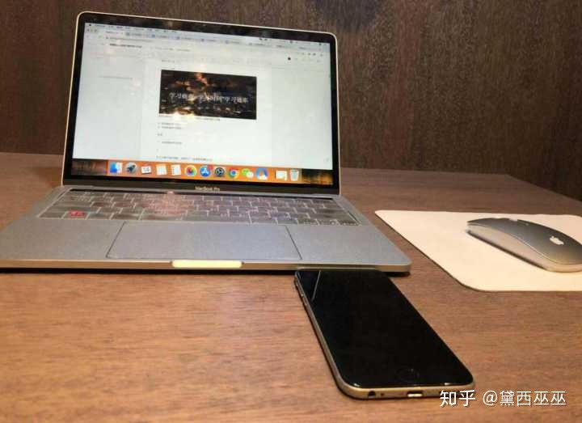（我常用的工作台，东西越少越好）

2. 播放轻音乐，1-2 首歌的时间，闭上眼睛冥想一会，深呼吸放松心情，睁开眼时，注意力会十分集中。

3. 可有可无的一条，有些人喜欢学习时听歌，可以放白噪音，帮助平缓情绪。

执行完一整套【PFHM】高度专注法，你就排除全部干扰，真正进入【心无旁骛】的状态，然而这仅仅只是一个开始。

还记得吗，黛西再强调一遍，（敲黑板，大家记好啦~）

空有好状态是不行的：学习效果 = 有效学习时间 * 学习状态 * 学习方法。

有些人白天看书、晚上也看书，甚至压缩睡眠时间去学习，没有休息时间，也不会浪费时间去消遣，可是学习效果仍然不明显， 因此会很挫败。

这类人已经做到了前两样，但差最后一样【学习方法】，也是最重要的一点。

想要取到高效的学习效果，好的学习状态只是辅助手段，高效学习法才是加速剂。

所以我们要解决更困难的第二个问题——如何学会高效方法。

这是重中之重，快打起精神来呀！一定要认真思考哦，对你会很有启发！千万不要捡了芝麻丢西瓜呀~

二、如何高效学习
------------

### （一）高效学习技巧

法国生理学家贝尔纳说过一句话：“良好的方法，能够让我们更好的运用天赋的才能，而拙劣的方法，则可能阻碍才能的发挥。”

所以，我们与学霸之所以有差距，不是因为智力和能力，而是方法出现了大问题。

我们必须按照大脑的运转方式，使用科学方法，培养提高学习思维，取得事半功倍的效果。

要知道，有了高效学习方法，能用 3 小时的高效专注学习，远远超过你 6 小时分散低效的学习收获。

这些高效方法，都是我掉了很多坑后，用血的教训总结出来的，一定要认真仔细看，至少能帮你提高 2 倍效率。

同上，我们先来纠正错误认知，再来说方法：

#### 1）学习误区：

误区一：学习时间不是越长越好

人的精力是有限，学习效率会因精力损耗逐渐下降，当你进入了疲倦期，再继续看下去，也只会是一个现象：这知识它不进脑子啊。

这就是为什么你在图书馆学了一天，也只记住了内容的原因。

你可能会有疑惑，那有些学霸为啥怎么学都不累？其实他们能保持清醒，长时间高效学习，很大一部分原因是，他们有更科学可持续的作息。

我结合了自己的经验积累，还请教了身边的学神级好友，汇总了一套超有效的学霸级作息方法，关注我的公众号「黛西巫巫」，就能拿到这份能让你逆袭成学霸，轻松拿高分的作息秘诀分享啦，长期保持能让学习效率提升起码 2 倍以上噢~

[敢对自己狠的女生，到底有多赚？​mp.weixin.qq.com](https://mp.weixin.qq.com/s/F74PoEoFGS6mHAwFLZjbPQ?WECHAT_ID=%E9%BB%9B%E8%A5%BF%E5%B7%AB%E5%B7%AB&BIZ=ECOMMERCE)

总之，利用好自己精力旺盛时间段，好好安排学习计划，要有强度而不过度地压迫自己。

这里也再次给大家推荐番茄工作法，25 分钟 + 5 分钟的结合练习，在高专注力的间隔间休息一回，会像按了重开机键一样，重新进入高度专注状态，不容易分心哦~

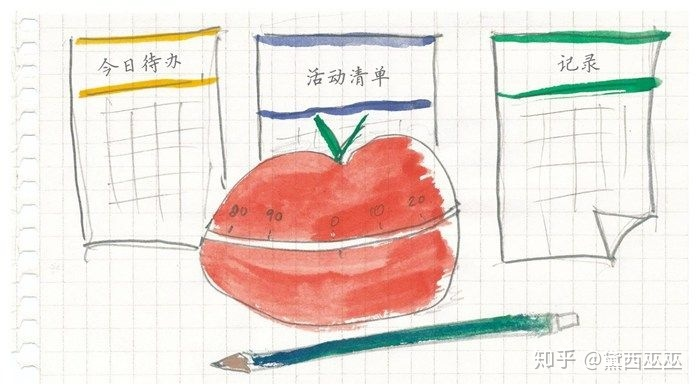

学会正确使用这个方法，能让你每天都处于高效的工作状态。

误区二：只记内容主体，无视知识扩充

很多人学习，只是表面学习。

学习是系统化过程，知识点是相连相结合的。就像英语词缀，能组成特别多的词语一样，懂得人能看到一片森林，而其他人只能看到一棵英语树。

知识是点与点的跳脱式信息，真正懂得学习的人，会抓住其中的关联，变成结构化的东西，进行复盘。这需要用到思维导图复盘方法，后面我再详细讲。

#### 2）交替学习（减少学习疲惫感）

学习同一学科 2 小时，和分别学习不同学科 2 小时，效果是完全不一样。

专一练习，会阻碍技巧上的进步速度，混杂练习，能深化对每一门学科的掌握。

所以学习时学科切换，是保证大脑对学习不会有疲惫感，不断接触新知识，反而能提高学习效率。

虽然拉开学习间隔，会让我们遗忘一些知识点，时间跨度越大，忘记的内容就越多。

但这些内容，恰恰是我们最没有掌握住的东西，明白了自己的不足，才能加强巩固，把知识重新储存一次，进一步加深印象。

另外给大家个小 tips：

思维和身体是一个整体，学习时能通过联想 + 肌肉记忆，深化知识印象。

比如：背单词试试边背边手写、学单词时，例如 “squat”（下蹲），可以边蹲边背，阅读时可以用手指或笔尖辅助、做笔记时记住关键词。

这个方法， 既提高阅读专注力，还提高记忆效果哦~

现在就是你做笔记的时候啦，点个赞，以后就能在动态看到啦，很方便，不用担心找不到了～

#### 3）刻意学习（最快的进步手段）

刚开始的学习阶段，进步最快，0 到 1 分的过程，只要你开始做，你就进步了。

最难的是 59-60 分阶段，这时学习跟减肥一样，遇到了平台期。

这个阶段，你保持原来的做法已经没用了，要么再少吃一些，要么加强锻炼。如果你坚持突破了，那么体重会蹭蹭往下掉，同理，学习效率也会咻咻往上涨。

这就是刻意练习的阶段，要打破这个局面，我需了解大脑构造。

科学性分析下大脑，它分为三个区域：

1. 舒适区（最内层）：熟练掌握的知识，已经滚瓜烂熟，脱口而出，学起来完全没有难度；  
2. 学习区（中间层）：能靠已有技能，去解决具有挑战性的问题；  
3. 困难区（最外层）：现在没法解决的专业性问题，属于看了答案也不懂的区域。

我们不能反复练习舒适区的内容，没有挑战性，也不能盲目克服困难区的问题，消减积极性。

我们需要做的，是不断在学习区中练习，一点一点突破舒适区，将学习区变成舒适区，才能不断收集成就感，从而对学习上瘾。

这个过程，要不断根据自己掌握的内容，重新调整学习计划，慢慢增加难度，如此一来，你也可以轻轻松松变成学习高手哦！

### （二）硬核支撑

拥有一个良好的身体状况和精神状态，是进行上面那些持续性优化事情的前提。

就比如汽车的外表、外加功能做得再精彩绝伦，如果发动机衰弱，照样是跑不快的好车，我们的身体就是那个发动机。

文前已经提到了环境因素，所以我这里只说运动、饮食、休息三个要素。

#### 1）运动: 身体能力——体力

运动冥想可以让大脑产生新的神经元，有助于发挥神经元的潜力。

我们要提高记忆效率，就是要增加神经元之间的链接。

而进行有规律的适量运动，就能让大脑中的海马体，增加更多细胞，让我们的思维、感觉和反应，变得更加灵敏，让大脑更加聪明。

另外，适量运动可以让身体放松和通畅，精神状态更加充沛，保持健康哦~

#### 2）饮食：精力燃料——基础

食物是身体的燃料，是保持超强精力的基础。

我们每天脑子会昏昏沉沉，觉得特别容易累，随便做点事情，都力不从心，想睡觉。

绝大可能是我们饮食出现了问题，高热量、高油、高糖、高碳水化合物的食物，都会让反应变慢，产生困意。

学会吃，是变牛逼的第一步。

#### 3）休息：精神能量——专注力

不要小看睡眠，拥有好的睡眠状态，是处理和储存新信息的重要步骤。哈佛研究表明，睡了好觉的学生，比熬夜又早起的学生，学习效果好 35%。

不信你去仔细观察，你身边的真正学霸，从不是熬夜低头苦学的人，有好睡眠，才能有高专注力。如果你总是睡眠不足，又或者焦虑失眠，推荐一本有关睡眠的高质量好书给你，名为睡眠革命，关注我的公众号「黛西巫巫」，你就能拿到我的分享啦~ 它能在 7 天内大大提高你睡眠质量噢，黛西亲测好评！

### （三）学习复盘方法

前面所说的内容，全都是在「输入」阶段，即接受知识和信息。

但看到≠记住，记住≠掌握，会学习的人，都知道「输出」的重要性，让大脑根据现有知识，产生新的信息。

美国教育专家埃德加 · 戴尔，也有提到过：

单纯阅读能记住的知识，最多 30% 左右。通过模拟实践、主动应用，记住的内容，却能高达 90% 左右。

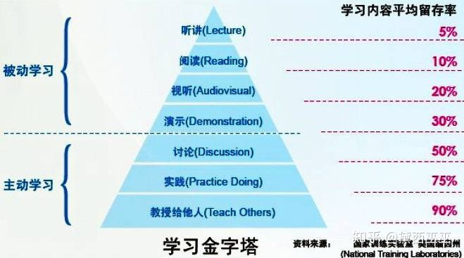

学霸和普通人的差距，就是【被动学习】和【主动学习】的思维差距，其实操作没有多困难，只是多了一步——回忆和复习，也就是【复盘】。

学习很重要，而在学习后进行持续性复盘反思，会形成更好的正向反馈。我坚持复盘这几年，不论是学习还是工作，都得到了 2 倍以上的效率提升，还不断亲身实践，整理出一套独家复盘模板，简单高效易操作，希望提高学习效率，养成复盘习惯的同学，这套模板可以作为你们的借鉴参考，关注我的公众号「黛西巫巫」，你就能一起分享这份高效复盘秘诀啦~

[敢对自己狠的女生，到底有多赚？​mp.weixin.qq.com](https://mp.weixin.qq.com/s/F74PoEoFGS6mHAwFLZjbPQ?WECHAT_ID=%E9%BB%9B%E8%A5%BF%E5%B7%AB%E5%B7%AB&BIZ=ECOMMERCE)

复盘是知识反馈的过程，也是建立知识体系的过程，还是提升高效学习不可或缺的重要步骤。

这里再分享两个我常使用的高效复盘方法给大家：

#### 1）思维导图——结构化思维（提高效率的好方法）

大数学家华罗庚提出过一个学习方法：先把书读厚、再把书读薄。

我们学习时，通过查资料、做题，来把书读厚，这是不断积累的过程，也是学习的笨方法。

聪明的人，会把知识吃透之后，把知识简化成体系框架，提炼最核心技能，也就是把书读薄的过程。

如下图所示，前者是散装思维，后者是结构化思维。

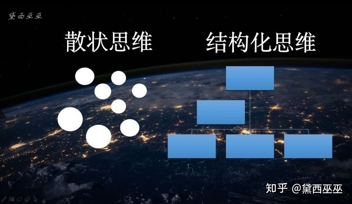

这就是结构化思维的好处，延伸出来的思维导图，能够让你对储藏的信息重组和提炼，进一步理清大脑。

如果你没有发现结构化思维的好处，我给你举个例子:

你的妈妈让你去超市买 1 瓶酱油、2 斤苹果、10 块猪肉、1 包盐、3 个火龙果、1 把生菜、一袋火锅底料、5 个鸡蛋、1 瓶油、1 把葱。

不经过整理的话，会记得非常混乱，买回来会缺三差两。

但梳理一下，这些信息就十分清晰：

调料类：1 瓶酱油、1 包盐、1 瓶油、1 袋火锅底料  
蔬菜类：1 把生菜、1 把葱  
水果类：2 斤苹果、3 个火龙果  
肉禽类：10 块猪肉、5 个鸡蛋

这样是不是醒目多了，还能根据分类，快速按顺序购买。

学习也是同样的道理，把未经加工的信息，转化为加工知识，才是我们真正吸收过的知识。

记住，任何没有经过深度思考的表面内容，都称为信息。

信息是学习最底层的东西，我们需要找到背后逻辑，经过大脑加工、理解、重塑，形成深度化的认知结构。

知识复盘，黛西强调推荐过很多次，不管工作还是学习，认真复盘都会给你带来巨大收益。

#### 2）费曼学习法（输出倒逼输入）

这个方法的核心，就是学到的东西输入后，立马去输出。

当你看完一本书后，能不能写出读书笔记，提炼出文章的核心。

如果写不出来，就要好好思考，到底哪个地方没看懂，带着问题去看书，是最好的提升办法。

当你学了一个技术时。立马去实操一下，过一遍流程。

当你学到很杂的理论知识时，用思维导图捋顺一遍，整理好放进脑子。

最好检验学习成果的方式，是把学到的知识点，传授给别人。

像老师教课一样，如果讲到一个地方卡住了，那么对知识点不够理解，再回去学习，多次循环，直到教会他，这个过程能收获到更多更深的知识。

这些方式不仅能锻炼逻辑、谈资，还能深化思维能力，更能让知识更好留存在大脑里。

### 三、奖励机制

最后的最后，就是要学会犒劳自己。

人是需要被认可的，努力了这么久，如果没有激励，可是会懈怠的呀。

定期给自己一个奖励：出去大吃一顿、买件平时不肯剁手的衣服等等，给予自己肯定的力量，才有源源不断的学习动力呀。

比如我写了这么多，打得手都酸啦，如果还没有你的点赞和鼓励，我就会受挫，进入一个自我怀疑状态，思考是自己写得不够好，还是表达有误，就会大大打击了自信心呀。（说到这里你们应该明白了吧哈哈~）

总之，学习是一场持久战，没有找对方法，学起来会非常痛苦，这一点我深有感触。

如果能避开上面说的那些坑，坚持我分享的建议和方法，一定能改变你现在的处境，没准还能爱上学习，一不小心就变成学霸呢~

最后，黛西送你们四句很受用的话，希望有启发到你呀：

1、现实就是，我们拖延的，往往是让我们感到不安的事情。

2、障碍总会出现，但不要把你自己的问题全部归咎于外部因素。如果每件事都是别人的错，那就是时候好好审视一下自己了。

3、我发现了，那些最有成就的人，总能 “束缚自己”。

4. 无论你给自己设置多低的要求，总比放弃不做好。

赠人玫瑰，手留余香。黛西码了 4 个晚上的字，希望能得到你的一个赞，我就很开心啦~

另外，如果你想要更多的成长干货和学习方法，欢迎你到我的公众号「黛西巫巫」找答案，里面有我最宝贵的私家逆袭经验，全部都毫无保留分享给你，比如很多同学都好奇黛西是怎么样快速成长的、平时看什么书、有什么读书方法和私人书单、怎么理财，这些都会讲；

还有我成功从挂科学渣逆袭成学霸的学习方法、哑巴英语变成英语达人的秘诀、自律长达 10 年的独门诀窍、连续高效学习工作 10 个小时的专注技巧……

我还会每天分享一篇优质的成长干货，包括理财 / 英语 / 自律 / 学习方法、变美习惯、优质书单 / 电影 / 纪录片 / APP。我还会在留言区解答读者的问题，比如说一个 20 多岁的年轻人，手上有 2 万有什么好的理财建议？比如说，英语基础不好，怎么在一个月内快速提升？这些我都会解答！

欢迎你来公众号「黛西巫巫」做客，我在那边等你，陪你一起精进哦~

[敢对自己狠的女生，到底有多赚？​mp.weixin.qq.com](https://mp.weixin.qq.com/s/F74PoEoFGS6mHAwFLZjbPQ?WECHAT_ID=%E9%BB%9B%E8%A5%BF%E5%B7%AB%E5%B7%AB&BIZ=ECOMMERCE)

大学生不可错过的大学 4 年必知常识，获得12 万人的高度赞同：

[高中生进入大学，有哪些必须知道的常识和经验？](https://www.zhihu.com/question/333443411/answer/772703241)

推荐我这篇高赞文章，浓缩了知乎道理类的全部精华：

[有哪些道理你后悔没有早点知道？](https://www.zhihu.com/question/23819007/answer/770099327)

推荐一篇能让你的生活效率得到2 倍提升的回答：

[如何每天只睡 6 小时，还保持一整天都精力充沛？](https://www.zhihu.com/question/379478413/answer/1102999850)

这篇回答可能引起你适度的不适，颠覆你以往对学习的观念，

自从有了正确的方法，从高中到现在，每天都基本上能专心持续学习 6h 以上，相信有足够的经验去解答你（自信）。

写之前，我看了 #学习# 话题下大概 300 多个答案，高赞的没赞的基本上都扫了个遍… 发现大家非常执着于“教你延长学习时间”和“提高专注度上”。

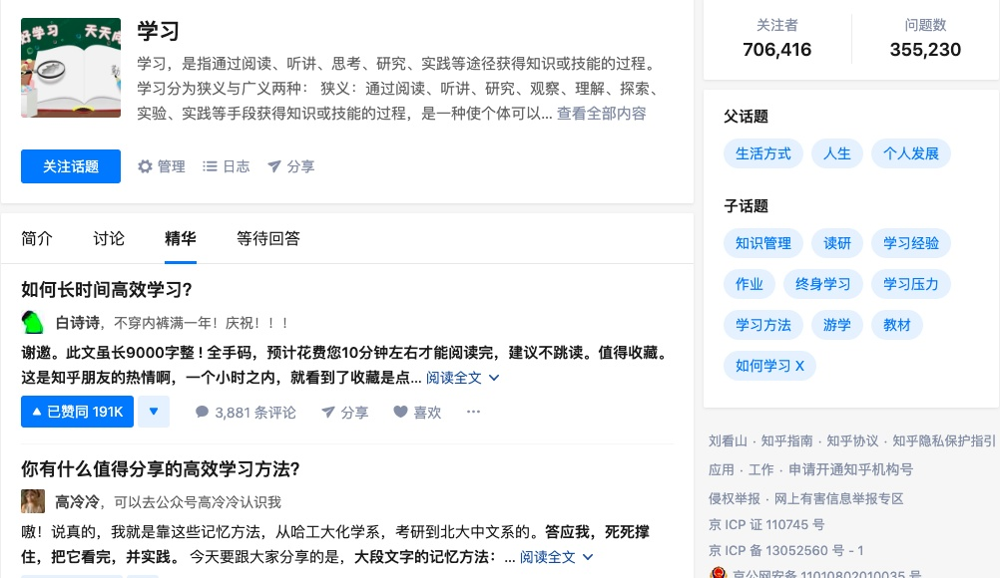

这当然很棒。但有没有想过一个核心问题：

## 我们为啥没办法心无旁骛的学习？

如果这点没想明白，其他的也就无从谈起。因为一件事，你打心底不知道它做了对你有什么价值，那么你的能动性就会非常之低。

所以，这和你的「学习成本」也大大相关，包括目的、精力、金钱......

学会最大限度地降低学习成本，也是延长学习时间，提高学习效率的保障。

综上，将从三个维度跟你将明白：（如果你看到最后的话会发现我们有一个学习成长社群，群是免费的，但谢绝广告和水聊）。

我很喜欢北辰青年的手账本，用来记录时间[北辰青年：怎么才能心无旁骛地学习？​nxw.so](http://nxw.so/43DtF?WECHAT_ID=yesgo06&BIZ=ECOMMERCE&BIZFROM=ORG)

### 第一部分：最大限度降低学习成本

1、想明白为啥学

做任何事情都有成本。

投入了学习，自然会花费你的金钱、时间、精力……

相信大家都有过这样的体验：逼着自己学了一大堆不明所以然的东西，却又不知道有何用。

这样的状态是非常糟糕的：因为不知道用在哪里，知识很难与大脑的发生连接。

这就导致你很难学会，学习时间长，学了也很容易忘记，学习成本很大，负反馈很多

负反馈和高成本又会反过来影响你的学习积极性，如此负向循环

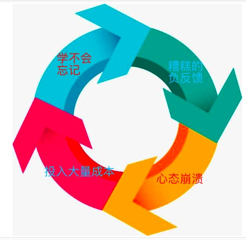

所以，首要之急，是想清楚学的目的。比如你学 PS，目的可能是为了考试，或者为了多一门技能，或者是为了让某项工作得心应手，又或者只是学来玩玩，p 一下自己好看的脸。

学了以后，能带给你什么好处？钱、魅力、技能、心情……

知道为何而学，会导致你的学习投入完全不同。

p 脸的就只学如何瘦脸磨皮调肤色就可以了，工作的可能则是注重效率性，更关注快捷键等操作。

西，都会在你想要的方向增加一点经验，你能感觉到自己正在进步正反馈开始起效！

2、时间和精力成本

我将会和你讲到习惯的重要性

大一时，大家都流行去自习室学习。

我都不知道要去学啥就去了，勤奋嘛。坐下就开始想，我今天要复习啥咧，啊，高数快考试了，复习高数吧。

然后才发现书包了关于高数的资料很少，又跑回去宿舍拿…… 来来回回，复习时间耗了一大半。

后桌的那个哥们，好几次看到我这样，实在受不了和我说：

你这样还能复习嘛？你应该养成一个习惯， 第二天复习会用到的所有东西，前一天晚上准备妥当。

甚至该怎么复习，时间怎么安排，都要提前准备。

当这些流程变成习惯，你根本就不用再花精力和时间思考，第二天起床背起书包，到了图书馆就可以开搞。

别小看这个习惯，在越大的企业，越流行这样的习惯机制，术语叫：SOP

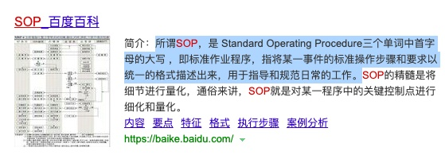

▲当一件事可以自动化，有条不紊的形成习惯，

最大的好处，是可以不用脑！其次是省时间！

记住啦，有效降低学习成本的第一个方法就是：用习惯代替简单的细节处理。

（看到这里都是优秀的人儿，可以花一秒钟先点个赞 mark 一下 哦～如果你看到最后的话会发现我们有一个成长社群，群是免费的，但谢绝广告和水聊。）

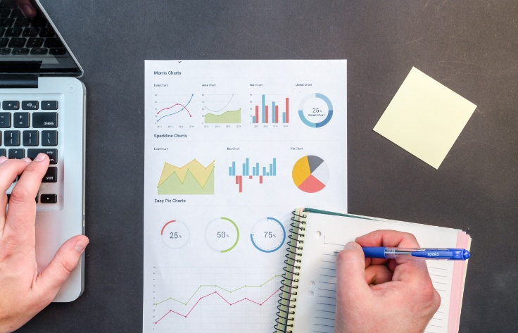[北辰青年：怎么才能心无旁骛地学习？​nxw.so](http://nxw.so/43DtF?WECHAT_ID=yesgo06&BIZ=ECOMMERCE&BIZFROM=ORG)

3、远离干扰物

今天是认真工作的一天。

刚准备写报告，叮，你有一条新的消息  
今日最新报道，震惊，错过你就后悔了！  
有人 @你，你真好看……

手机拿起来，又放下，拿起来又放下

精力被无限切割。你又忍不住看了娱乐八卦，还打了盘小游戏……

说好的好好工作呢？

你要尽量远离噪音干扰，避免频繁状态切换时，不必要的意志力损耗。

有效降低学习成本的第二个方法：

降低一切与学习无关的噪音，对你的干扰。

### 第二部分：延长学习时间

①减少无意义的时间浪费  
②提高对时间的精准把握  
③进行恰当的精力管理

如果你看过网球王子，你就会知道有一种「心流」状态，无论对面打过来什么球，进入心流状态，都可以无意识的用最好的回击方法回击球：

学习也一样，如何进入这种「心流」状态呢？

首先，最简单的。减少无意义时间浪费

但不能盲目减少，一天 24 小时学习，会搞死你自己。

先来看下面这个图：

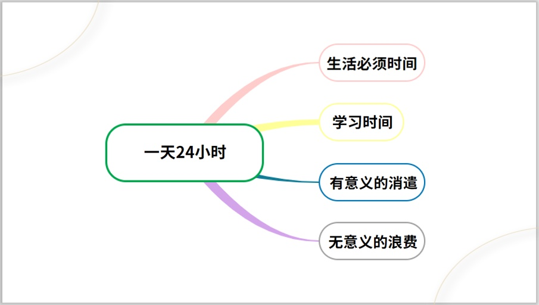

生活必须时间，指的是你为了生活不得不用的时间，比如吃饭睡觉。

有意义的消遣，是指那些有利于调整状态的放松或娱乐。比如累了去散步，去买杯奶茶咖啡。

这些时间也是你必须投资的，无需有罪恶感。

无意义时间，是你真正要警惕的。

“无意义” 基于不利于你持续高效学习的角度来说的。

比如刷娱乐新闻、刷娱乐性的短视频、看电视剧、玩电子游戏...... 这些都会极大耗损你的精力。

想要心无旁骛学习，这个必须严控。除非你今天学完了，才能放纵自己去玩。

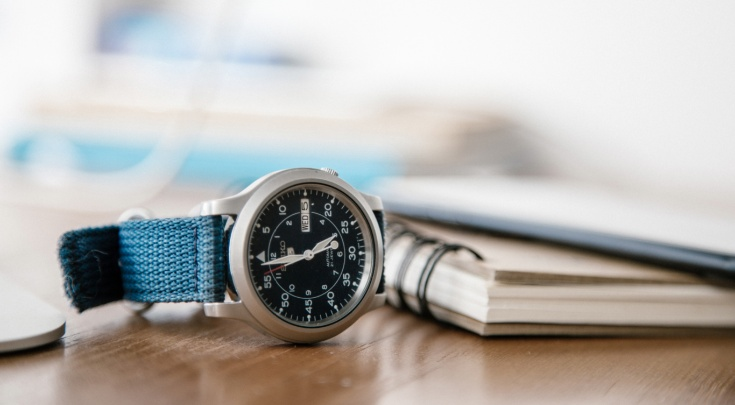

其次，我们需要逐渐养成对时间的精准把握。

我的直属上司给了我一个很好的 “计算时间” 的习惯

体育考试的时候，老师拿着秒表，400 米给你记一个时间。

很好，你的学习，也需要这样的计时。

比如，你第一次写英语习题，ok 估算 1 小时，实际，1 小时 15 分，记下来。

下一次就稍微调整，往更合理的区间去估算。这样不断地估算再调整，对时间的感知会越来越准确。

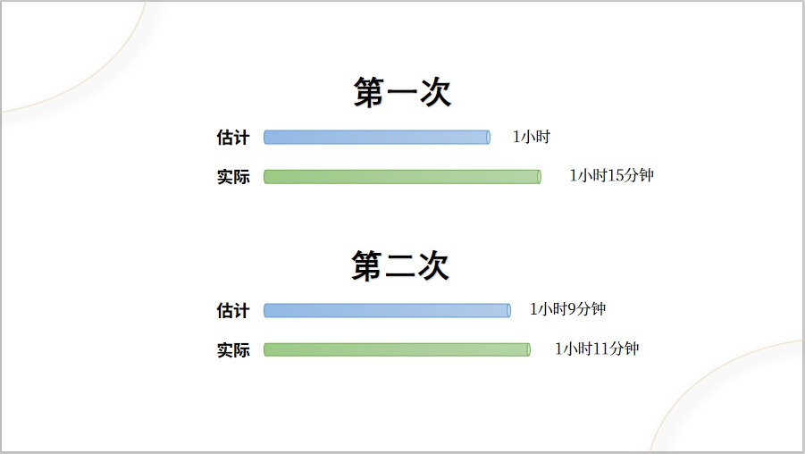

后来我不止在学习工作上这么做，估算时间的习惯也可以用在生活。

现在我已经能准确地知道自己吃饭、洗澡、赶路、以及复习一章课本内容所需要的时间。

感知时间的能力非常重要，他能让你最大限度的避免时间浪费。甚至无需做计划就可以掐准点完成事情。

当然，好的身体状态是必不可少的。这就要求我们做好精力管理。可以参考下面的回答

[如何长时间高效学习？](https://www.zhihu.com/question/28358499/answer/940763401)

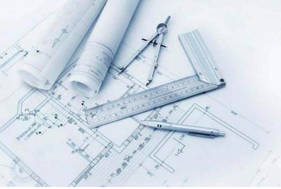

### 第三部分：如何提高学习效率？

分享三个高效学习工具

#### 1、时间里程表：

这个是市面上广为流传的方法，核心原理是：可视化时间。

具体操作：

①用 Excel 表格，每一格代表半小时，刻意记录和安排自己的时间。  
②一天 24 小时，如果除去休息、吃饭这些时间，至少可以剩下 14 小时，也就是 28 个格子。这 28 个格子，是你做所有事情的核心资产了。  
③然后围绕这 28 个格子，提前把它铺满，第二天的时间安排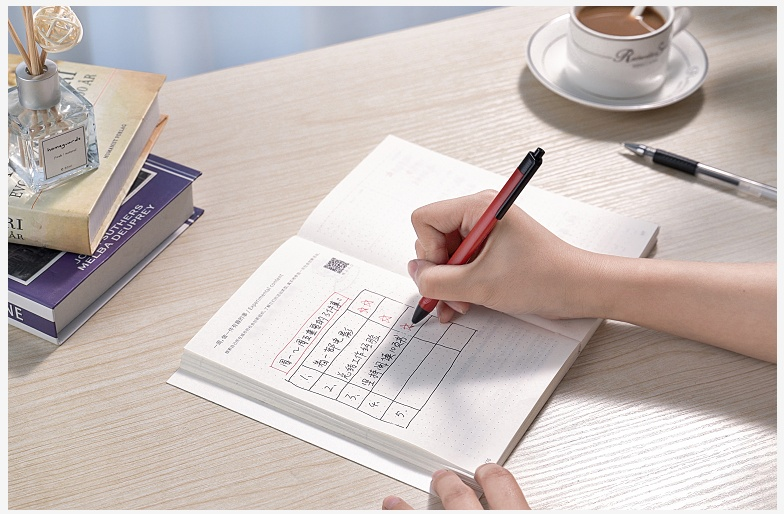有时我也会记在手账本上

我觉得其实市面上的那个有点麻烦，而且第二天也会有很多突如其来的事情。

所以可以简单的把第二天要做的事规划好，大概抽多少个小时去做，做好这样的管理，第二天看心情去分配什么时候去做就好了。

过年做的规划，也可以是这么大块时间

当你逐渐习惯了这种刻意记录和反思复盘，你会发现自己对时间的感知会越发敏感而准确，直到最后不再需要这个工具进行辅助。

#### 2、复杂度管理：

北辰青年未来大学基石学院里，文中老师提出了一个很好的概念：复杂度管理。

简单来说就是，把一堆乱如杂草的事情，变成简单清晰的事情。像这样

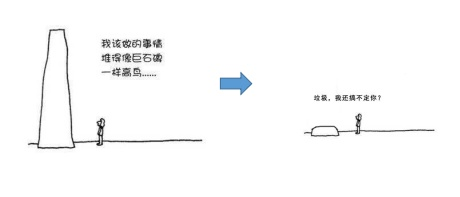

这里就只介绍：追踪系统、习惯声明

▲追踪系统

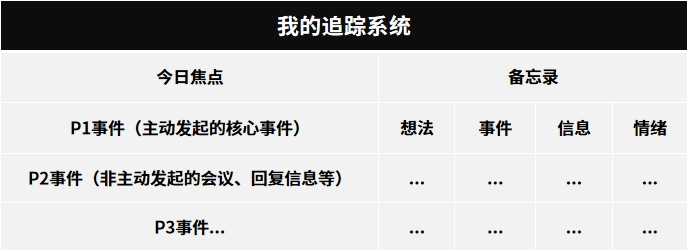

利用这个追踪系统表格，每天开始工作时，先把注意力聚焦在你 “今日焦点” 的 P1 事件

P1 做完后，继续 P2 事件，以此类推

中途有其他突然冒出来的小事，如果不是特别紧急，就在备忘录那一栏记录下来。

避免原先的工作突然被打断。

▲习惯声明

为自己预留一段完全不被打扰的时间，专注自己的学习。期间不看手机，不回复任何信息。

等这段专注时间过去后，再回复消息说：“不好意思，现在才看到消息，我每天的 X 点到 Y 点这段时间安排给学习了。”

有了这个声明之后，再回复对方的事情。

既回答了对方问题，同时也表明了自己的习惯。所以下次对方再找你，也会斟酌和考虑合适的时间。

这样可以确保自己在高效投入学习的过程中不会轻易被干扰。

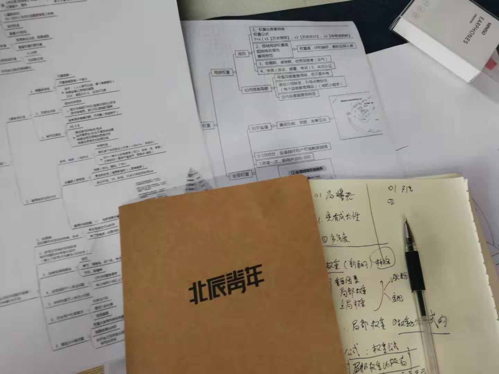

####  3、费曼学习法：

爱因斯坦说过，如果你不能用简单的语言去说明一个知识点，说明你还没有完全明白这个知识点。

而费曼学习法，就是通过复述知识教给别人，从而强化对知识的理解记忆。

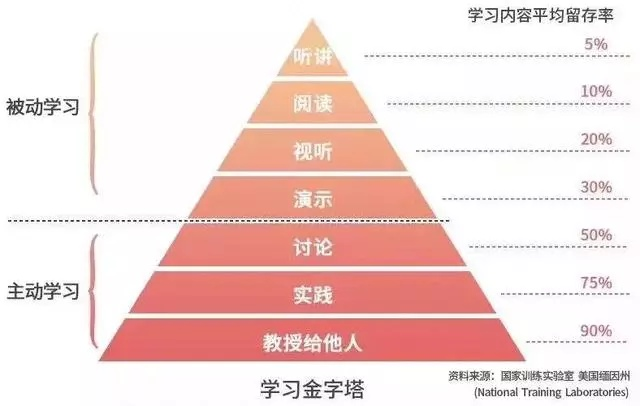

通过这张学习金字塔的图示，我们可以看到：在多种主动学习中，教授他人，是学习内容留存率最高的做法。

但这里有个前提是：你必须是秉着负责任的态度，发自内心想教懂对方。

通过查阅大量资料，确保自己完全理解透彻，才敢把知识教授给对方。

加拿大学霸斯科特 · 扬，也正是利用了费曼学习法，在家自学 12 个月，就完成了寻常学霸需要花 4 年才能完成的麻省理工大学 33 门计算机课程。

