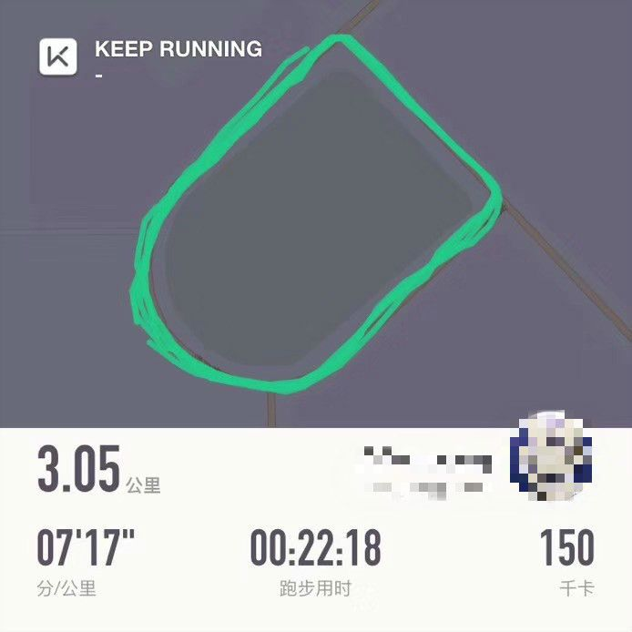

# 分享一个我长期保持自律的秘诀

> 本文由 [简悦 SimpRead](http://ksria.com/simpread/) 转码， 原文地址 https://mp.weixin.qq.com/s/E-IgBfXgsGoTyyEuy6icZQ

  

我最近总是收到很多读者的留言，有个问题很有共性：就是**如何逼自己做到真正的自律？**

  

他们很用力地逼自己早睡早起，每周读书、健身，但是往往坚持没几天，就放弃了。

  

如果你也有这方面的困惑，那这篇文章太适合你了。

**因为「逼自己自律」这个观点，本质上就是错误的。**按照一个错误的逻辑去行动，怎么可能成功呢？

  

下面，我将和大家说下，如何真正持续地做个有效自律者。**学会这套自律方法，自律就像玩手机和游戏一样轻松。**

文章有点长，4000 多字，但请答应我，咬牙读完，腰挺直认真看，一定可以帮你改变糟糕的生活。

## 1、先认识什么是真正的自律

  

6 点半起床到图书馆，低头看书学习到午饭时间；

  

吃饱后在桌子上趴一会，中午两点开始继续学习到晚上 10 点，除了晚饭外都在看书。

  

周一到周六都机械般重复上面的事。

  

你觉得这是自律吗？

  

**不是，这跟流水线生产东西一样，只是一种流程。**

  

这种生活让人难以忍受，枯燥无味，大多数人坚持一段时间后都会放弃，不具备普适性。

  

那么，什么是真正的自律？

  

首先，你得想明白自己要什么。

  

**有些人的自律之所以是假的，就是因为他们没有明确的目标**，他们之所以给自己制定了很多计划，只是因为感觉人就应该努力，不努力就是堕落；

  

然后偶尔努力一下就会有一段时间感觉到踏实，但过几天又会因为坚持不下去堕落了。

**所谓的间歇性努力持续性混吃等死，基本就是这样产生****的**。

所以，你要给自己定一个目标，让欲望和动力去驱动你，而不是焦虑和自责，当每天唤醒你的是梦想而不是闹钟，你就开始明白什么是真正的自律了。

  

## 2、如何让自己变得自律起来

  

**「清华北大只是过程，不是目的。」**

****

**「人生就像射箭，梦想就像箭靶子，如果没有箭靶子，你每天的拉弓就毫无意义。」**

  

《银河补习班》里的邓超希望儿子能想明白自己要什么，说了这两句话。要想自律，你先要找到自己的箭靶子。而这箭靶子，也就是我们的自律驱动器。

  

**如何找到你的自律驱动器？**

### **1）首先要理性地面对自己的欲望**

一个经常健身，不吃油炸食品，八块腹肌的帅哥，他之所以自律，是因为喜欢别人看他时羡慕的眼神，是因为他爬 10 楼楼梯都不累时的那种从容，这些欲望让他战胜了大汗淋漓时想放弃的心。

  

一个清华北大的学子每天依旧刻苦学习，他之所以自律，是因为想要改命的决心，是因为他希望父母看到自己功成名就时能开心地笑，上清华和北大不是他的目的。

  

**通过努力而改变自己的命运，让家人过上更好的生活，这些才是他的目的，也正是因为这些欲望让他战胜了懒惰和不想学习的心。**

那么，你有什么欲望呢？

  

比如，我想发财让家人过上更好的生活、我想拥有一个好的身体能在床上更持久让伴侣开心等等。

  

### **2）接着，直面你的欲望，然后把你的欲望具体化**

  

**最好精确到能用数字表述出来。**

  

比如，我想 3 年赚 100 万，给家人买 1 套房，我想坚持 30 分钟。

  

然后，把你足够具体的欲望写下来，可以放在床头，也可以放在手机备忘录里，只要你能经常看到就行。

  

### **3）把目标细分化**

  

比如说，你想 3 年赚 100 万，那么你每个月要存 2.8 万，然后，你需要掌握什么技能，升到什么职位，完成这些需要做哪些事，细分到每一天去，只有当你足够想要，你才能得到。

  

然后，在执行的过程中，你还要不断提醒自己最初的计划，因为如果你一个星期没思考的话很容易就忘，**千万不要对你的大脑过度自信，**重复提醒自己才能让你最终收获到果实。

  

接着，像我最开始说的那样，不要把计划做得太机械，而且也不要有过度完美主义，当出现问题时，平静沉稳地解决就行，不要指责自己，继续下去。

## 3、像玩手机一样轻松的自律方法

  

**1）用「方式替换」帮你喜欢上自律的生活**

我之前因为工作一直需要对着电脑，身体虚弱了很多，所以就想要运动锻炼下身体。

  

一开始选择了到户外跑步，但坚持了几天我就放弃了，因为跑步是一种没有太多惊喜的运动，很枯燥无味。但那时我还是把原因归为自己不自律。

   

以前尝试跑步，但没坚持多久

后来偶然一次，朋友拉我去健身房，我被好几个运动吸引了，瑜伽、搏击操、有氧舞蹈，到现在两年多，我每天都会锻炼 1 小时左右。

  

跑步让我想死，瑜伽、搏击操、有氧舞蹈等运动使我快乐，但这些运动都是能实现我锻炼身体的目标，所以，**在不影响终极目的情况下，可以去寻找适合自己的方式。**

比如你定了一个运动目标，可以去试一试跑步、篮球、台球、舞蹈等等，找到自己喜欢的再去行动。比如你喜欢摄影却在做着文案的工作，那么就辞职改成去影楼工作吧，**这样产生的自律才是健康且长期的。**

**2）每一小步都值得干杯**

有什么样的方法，能让没耐心的小孩把一件繁琐的事做好？

当他完成一小步，就给他一颗他喜欢的糖，当他完成第二步，再给他一颗；第三步，再给他一颗，十步、十颗，他完成了。

大人也一样，当你完成一个分期任务之后，我们需要为自己取得的成就庆祝，哪怕这成就很小。

**对你付出的努力作出肯定，这种庆祝的仪式感会产生正向的反馈，让你的自律生活处于正向的循环。**

 

**3）让你的身体充满能量**

  

身体虚弱的人，真的很难谈什么享受生活，更别说坚持自律的生活，**一个人生活中 80% 的不开心，基本也是来源于没睡够或者吃不好。**

  

所以，用（1）的方法去找到一个你喜欢的运动方式，锻炼好身体，用下面这张图，把自己喂成一个营养健康的人，而在这过程中，**你不仅能享受到身体逐渐变好的红利，还能借着这个过程培养自己的自律习惯。**

  

       

中国营养学会根据设计的中国居民膳食指南，靠谱，也很有普适性

## **4）找到优质的环境和志同道合的人**

  

在宿舍学习的效果不如在自习室和图书馆、在家里工作的效果不如在办公室。一个坏的环境让好的人变差，一个好的环境能让一个坏的人变好。

  

所以，找到一个能让你心仪的环境很重要，比如说你想健身，可以尝试在家里买一个跑步机、也可以去户外跑步、还可以去健身房里运动，但千万不要去空气很差的地方跑，**在经济条件能接受的情况下，找到最优质的环境，对你的人生有很大的帮助。**

  

**另外，要远离那些打击你成长的人。**

  

这种打击分为「**被动打击**」和「**主动打击**」。

  

**被动打击如：**你身边那些好吃懒做、喜欢打游戏刷抖音、不思进取的人，他们会同化你的思维，让你提不起劲去努力。

  

再比如说：你想戒烟，而当你身边的人都在吸烟的时候，你想戒都借不了，因为不仅你看别人吸的时候会有瘾，而且总有人会递烟给你。

  

更可恨的，是那些知道你戒烟后还跟你说：“戒什么烟，男人不抽烟不喝酒，算什么男人。” 这种就是最可怕的主动打击了，像学生时代也有一些人喜欢刺几句去图书馆学习的人。

  

**如果你身边有类似的人，请远离，哪怕需要付出代价，长痛不如短痛。**

  

**真正好的社交关系，是 1+1>2 甚至大于 3 的，**大家一起学习、一起看书、一起研究赚钱方法、一起成长，互相帮助对方解决困难，在这种氛围和环境里，自律是顺其自然且幸福的。

## 4、提升工作效率，时刻保持饱满的精神状态

  

### **1）规律的作息**

一个在白天睡觉、晚上工作的人身体好？还是一个在晚上睡觉，白天工作的人身体好？

  

答案是一样的。

  

**真正会伤害人身体的，是作息的不规律**，比如倒班，比如你今天晚上 12 点睡，明天 10 点睡，后天晚上 3 点睡，这才会伤害你的身体。

  

有规律的作息会让身体各部位能够知道在该休息的时候休息。如果无规律，身体就无法协调一致。时间久了就如该保养的车没保养，会出事故的。

  

所以，早睡早起不是重点，规律的作息才是。保持充足且规律的睡眠，人的思维活跃，精力旺盛。

  

### **2）番茄工作法**

  

“番茄工作法是由西里洛创立的一种相对于 GTD 更微观的时间管理方法。使用番茄工作法，选择一个待完成的任务，将番茄时间设为 25 分钟，专注工作，中途不允许做任何与该任务无关的事。

  

直到番茄时钟响起，然后在纸上画一个 X 短暂休息一下（5 分钟就行），每 4 个番茄时段多休息一会儿。”

  

**学会使用这个方法，能让你每天都处于高效的工作状态。**

  

### **3）曼特拉冥想**

冥想的方法：平躺着，做深呼吸，注意力放在呼吸上面，可以跟着呼吸的节奏在心里默念 “呼”“吸”，如果注意力分散了，就重新来过。

**每天 5 分钟的冥想，会让你受用无穷。**

想象自己躺在一片绿色的草地上，软软的，绵绵的，阵阵清香扑面而来。蓝蓝的天空没有一丝云彩。

潺潺的小溪，从身边缓缓流过，叫不出名的野花，争相开放。

  

远处一只母牛带着它的崽崽在散步，身边孩子们尽情地嬉戏玩耍着。

  

一只蛐蛐在地里蹦来蹦去，还有那树上的鸟儿不停地在歌唱。（还可以下载一些帮助冥想的音乐）

  

### **4）杀死时间黑洞，除掉干扰源**

卸载一些消耗时间的 APP：游戏、抖音、快手、垃圾小说和脑残剧。

  

工作时关掉干扰源：朋友圈的红点、手机信号等.

  

整洁的桌面：不要放太多东西，漫画书、零食、美女海报等会让你分心的东西都清理掉。

  

**有两句话一直激励着我，也送给你们：**

  

1、“**真的想做成某件事，如果可以的话，就从现在开始，不是明天，不是下个月，就此刻，然后坚持。即使今天跟明天之间，也隔着很多意外，所以不要等。

  

2、“**乾坤未定，你我皆是黑马**。”  

  

 原文地址 https://mp.weixin.qq.com/s/E-IgBfXgsGoTyyEuy6icZQ

