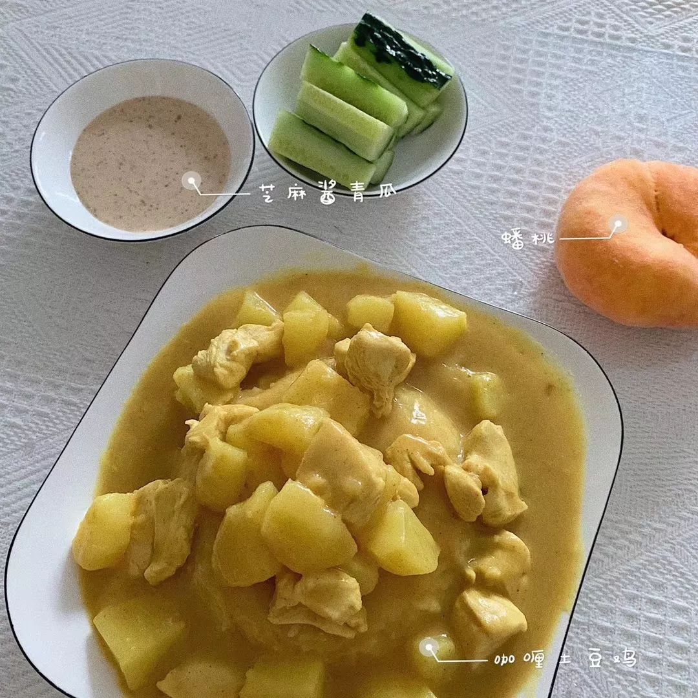
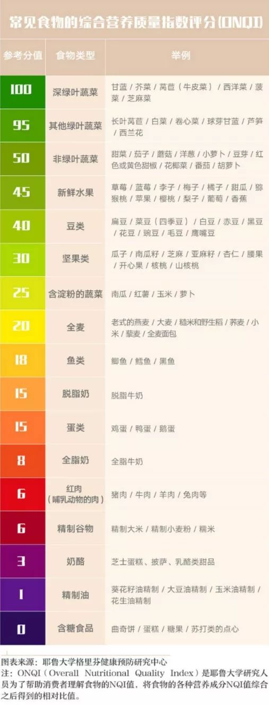
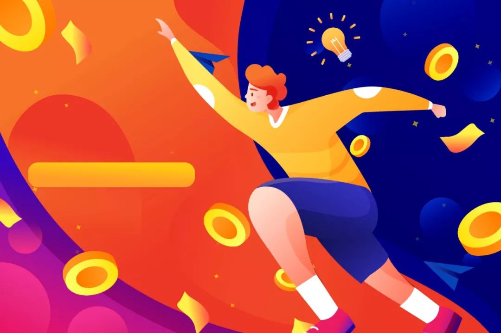

# 分享一套厉害的学霸作息方法

今天我来讲讲我自己的经历，这篇文章有 4000 多字，大概需要花费 11 分钟，希望大家能耐心看完。  

黛西刚进大学时，又肥又丑不说，每天脑子还昏昏沉沉，特别容易累，随便做点什么事情，就力不从心想睡觉，大一还挂了科，没男生喜欢，除了追了几部剧一事无成。

久病成良医。

经过自己不断地实践、总结，我逐步总结出了一套非常实用的精力管理方法，我称之为「DSRE 精力管理法」。

这套方法，帮助我从大二开始向学霸之路迈进，每天像上了发条一样，一天做别人两天的事情，轻松获得超过同龄人的成就，享受学渣跪舔的快感~ 哈哈

这套方法的核心，就是通过调节内外部环境，使自己的身体一直处于最健康的状态，保证有充沛的体能去学习。

<!-- more -->

  > 本文由 [简悦 SimpRead](http://ksria.com/simpread/) 转码， 原文地址 https://mp.weixin.qq.com/s/y_cyLVAeWPW6Ya4m9HQU-w

大家好，我是黛西。

今天我来讲讲我自己的经历，这篇文章有 4000 多字，大概需要花费 11 分钟，希望大家能耐心看完。  

黛西刚进大学时，又肥又丑不说，每天脑子还昏昏沉沉，特别容易累，随便做点什么事情，就力不从心想睡觉，大一还挂了科，没男生喜欢，除了追了几部剧一事无成。

久病成良医。

经过自己不断地实践、总结，我逐步总结出了一套非常实用的精力管理方法，我称之为「DSRE 精力管理法」。

这套方法，帮助我从大二开始向学霸之路迈进，每天像上了发条一样，一天做别人两天的事情，轻松获得超过同龄人的成就，享受学渣跪舔的快感~ 哈哈

这套方法的核心，就是通过调节内外部环境，使自己的身体一直处于最健康的状态，保证有充沛的体能去学习。

下面我将从 4 个方面，给大家分享持续保持超强体能，效率倍增的「DSRE 精力管理系统」：

> 1、D-diet，饮食
>
> 2、S-sport，运动
>
> 3、R-rest，休息
>
> 4、E-environment ，环境

## D-diet，饮食

食物是我们身体的燃料，是保持超强精力的基础。英文里有一句话「You are what you eat」，你吃什么，你就是什么。

人吃饭就好比汽车加油，不加油就跑不动。而吃什么食物，就像汽车加什么油，95# 肯定比 93# 更耐用，对汽车更好。

学会「吃」，是变牛逼的第一步。

我身边有很多人，每天睡 8 小时，也经常运动，但就是容易累。后来才知道她中餐经常吃肯德基的炸鸡可乐，难怪容易疲惫。

我们所选择的食物应该是让身体没有负担的食物，让人食用后感觉轻松，精力更加充沛。

自制健康小早餐~

当我们吃太多高糖、高油、高热量的垃圾食品，比如汉堡、炸鸡腿、奶油蛋糕后，会明显感觉反应变慢了，然后越来越困。

这是因为大量的劣质 “燃料” 进入体内，消化起来非常吃力。

为了消化这些食物，大量的血液集中到胃部工作，大脑就会出现供氧不足。这些垃圾食物，就像劣质汽油，再好的跑车，也经不起几下折腾，跑不了多久就抛锚了。

垃圾食物，不但无法增加精力，反而损害我们的身体，让我们感觉很累。

如果你以为只有薯条、炸鸡才是垃圾食品的话，那就太天真了。

有个颠覆你认知的观点：米饭、面条等高碳水化合物的食物，都可以定义为「垃圾食品」。

为什么呢？因为高碳水化合物的食物都容易变成糖，让血糖升高很快。

血糖如果上升过快，会导致胰岛素快速分泌，引发色氨酸进入大脑。而色氨酸是合成褪黑激素的重要原料，褪黑素越多，我们就越容易犯困。

要想精力充沛，在吃的方面有这条重要的规律：

吃「营养质量指数高」的食物

营养质量指数 Nutritional Quality Index，简称 NQI， 是食物里所含营养素占供给量的比除以所含的热量占供给量的比，就是它的 NQI。

简单地说，NQI 越高越健康。这里有一张 NQI 食谱图，非常实用，建议大家收藏，顺便给我点个「在看」，分享给更多的朋友。大家可以看到米饭、面条这类高淀粉食物，营养已经排到非常靠后了。

毕业后我到一家德企工作，发现德国人从来不睡午觉，因为不困。反而他们对中国人午休很不解。

其实很简单，就是因为我们的饮食结构，午餐大都是米饭面食这类高碳水化合物，吃完容易犯困，所以靠午觉来补充。

老外喜欢吃三明治、培根、火腿、鸡蛋这些 NQI 相对高的食物，就不会对身体造成负担，产生睡意。

NQI 食谱

----------

## S-sport，运动

生命在于运动，这个大家都知道。

因为人在运动的时候，血流速度加快，身体分泌大量的激素，能够给大脑提供充分的氧气和养料，并且清除代谢的废物。

同时，血液循环中的氧气和葡萄糖都会上升，加快大脑代谢，让脑子更加灵活，精力多得要溢出来。

美国国家卫生研究院有调查，一个长期静坐的人，死亡的风险比一般人要高 50%。由于缺乏运动所导致的死亡，甚至超过了吸烟。

同时也要注意，不要瞎锻炼。运动过量 = 慢性自杀。很多在运动中猝死的例子不在少数。那么运动时间多长合适呢？

世界卫生组织建议：一个成年人，最好每周至少 150 分钟的中等强度的有氧运动。也就是每天如果半小时的话，一周要五天。

很多人可能会觉得，自己很忙，哪有时间运动，这是个伪命题。

你没有时间运动，只能说明你把运动这件事的优先级，排到最后了。奥巴马每天下班都要跑步，你能忙过美国总统吗？

好吧，如果你实在是比总统还忙，我这里还有一个办法，就是利用碎片时间，见缝插针地运动。

上厕所的路上，做 2 分钟颈椎操；工作 2 小时，起来喝点水，搓搓脸。下班后走一段路，再坐交通工具回家。

还有一种 hiit 训练，就是高强度间歇性训练，在短时间燃烧大量能量，听说包括陈伟霆等很多鲜肉明星都在用这个方法。

这些微不足道的运动，都可以帮助你达到不错的锻炼效果。

归根到底，你不想锻炼的本质原因，是你没有找到自己喜欢的运动。

我自己就是如此。

我很喜欢村上春树，他非常推崇跑步，所以我也跑了一双跑鞋，学他每天早上晨跑。结果没坚持半个月，身体没练好，还把膝盖给磨伤了，只能放弃。

后来我跟朋友去健身房玩，发现瑜伽很有趣，还有搏击操、有氧舞蹈这些运动项目，都特别合我胃口，我甚至还学了钢管舞……

以前跑步对我来说，是一项需要很辛苦去坚持的运动，这说明我本能地在抗拒跑步。现在这么多运动花样，我喜欢还来不及，哪里需要苦逼地坚持？我简直是上瘾，把运动当成了一种乐趣。

每次出门前，我想到运动后那酣畅淋漓的感觉，还有性感的马甲线和大长腿，都感到很兴奋，恨不得马上飞到健身房。

坚持了不到半年，我瘦了 20 来斤，而且身体状态非常好，连续工作 10 个小时，都不会觉得累。

R-rest，休息
-------------

科学已经证明：对于绝大多数的人来说，想在一个领域做到顶尖，一定要睡足觉。这是保持精力充沛的秘诀。人在睡眠的时候，身体是一个主动的修复过程。

我们有时候身上有一个小的伤口，睡一觉起来就不怎么疼了。这是因为睡眠过程中肌体在修复。

如果好几天熬夜没有睡好觉，人就容易生病。这是因为睡眠不好的时候，人的免疫力就会下降。

美国国家睡眠基金会推荐，成年人每天的睡眠时间是 7 至 9 个小时。

要获得优质睡眠，其实很简单。有两个很好用的方法：

> 1、在临睡前 90 分钟就要远离手机、iPad、电脑、电视等电子类产品。尽量少看这种发蓝光的电子设备，因为会抑制褪黑素的分泌。
>
> 前文说过，褪黑素是促眠的，能让你感到困，快速入睡。  
> 2、白天充分地运动。白天够累，晚上自然就能睡着了。

假设你因为各种原因，熬夜缺觉，怎么办呢？

不用焦虑，一周之内晚睡不超过两次，精力是可以恢复的。

前一晚熬夜，第二天就用更多的时间补觉。例如提前上床，晚上多睡一两个小时，这是最好的补救。

午睡的作用：

之前有提到，中国人是习惯午睡的。午睡虽然不能使大脑得到深层修复，但有快速清理内存的效果，类似让大脑关机重启，能使疲惫得到快速缓解。

但需要注意的是，打盹儿和午睡时间不要超过 30 分钟。

保持浅睡眠状态，才能起到快速清理内存和重启的效果。没有睡着，闭目养神 20 分钟也不错。

如果超过午睡 30 分钟就会进入深度睡眠状态，这时被叫醒，反而会感到不舒服，睡得越久，感觉越累。

## E-environment ，环境

之前 3 点说的都是内部因素，外部环境也直接影响我们的精力和学习状态。

要营造一个好的外部环境，有 4 点值得注意：

1、采光好

光线太强或者太弱时，我们的眼睛很容易产生疲惫，无法集中精神，长时间还会造成头晕、抑郁、影响睡眠等。

白天的话，尽量用自然光阅读。光线不足的晚上，建议大家使用无频闪的护眼灯，用舒适的暖黄光，保持阅读的舒适性，也不容易形成近视。

2、通风好

经常开窗通风，可以保持室内空气新鲜流通，有大量氧气促进人体新陈代谢。

同时室内通风好，病菌的数量就减少，因为有些病菌只能在阴暗潮湿的环境中生存，一到空气流通阳光充足的环境里就自动消失了。

3、整洁

我们的工作桌面，一定要整洁有序。这不是为了装逼，至少有两个好处：

1、整洁的环境，是一种高级的仪式感，让我们以更愉悦的心情投入学习；

2、东西越少，干扰越少，有助于我们能够不间断地持续工作。

4、安静

并非所有人都有「闹市读书」的能力。与其花时间去磨练专注力，不如直接了当地给自己一个安静的学习环境，最大程度减少干扰。有两个办法：

1、下载白噪音软件。如潮汐、noizio。他们可以模拟大自然如海水、森林、下雨的环境，利于我们沉浸式工作

2、带耳塞或者降噪耳机。带耳塞直接屏蔽噪音，降噪耳机可以用物理方式，隔绝掉噪音，感觉好像进入一个真空环境里，非常的安静。

  

最后总结

学霸也是人，也需要吃饭睡觉，并不是像永动机一样，无止境地工作。

普通人如果做好精力管理，也能像学霸一样，持续高效地学习，用最少的时间，成为一个牛逼的人。

我分享的这套「DSRE 精力管理法」，从饮食、运动、休息、环境 4 个方面，全面系统地帮你打造超强的精力管理系统。

1、饮食上：

吃「营养质量指数高」的食物。

2、运动上：

保持每天 30 分钟的运动。

找到喜欢的运动，你会爱上锻炼。

如果没空，就用碎片化时间运动。

3、休息上：

远离手机，白天重复锻炼，晚上自然睡得好。

午睡要有，但时间不超过 30 分钟。

4、环境上：

工作环境要采光、通风好，桌面整洁，周围安静，才能让我们一直高效。

写得好辛苦，如果喜欢，希望帮我点个「在看」，安慰我一下哦。

原文地址 https://mp.weixin.qq.com/s/y_cyLVAeWPW6Ya4m9HQU-w